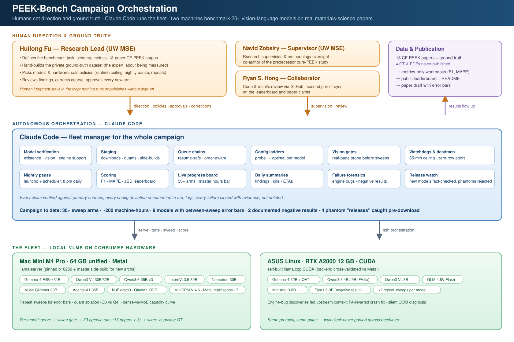
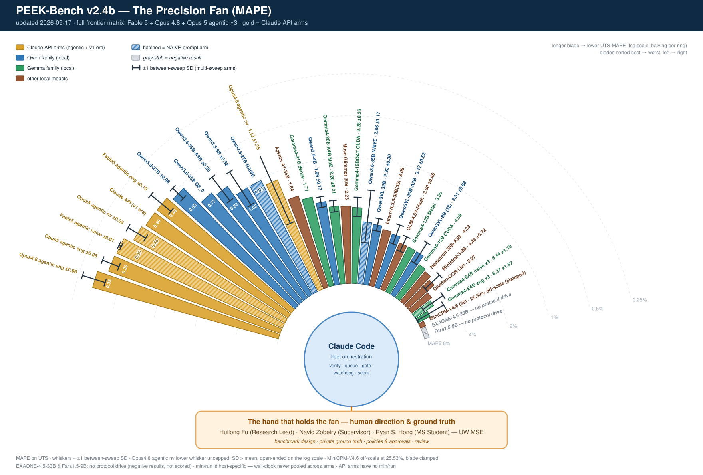
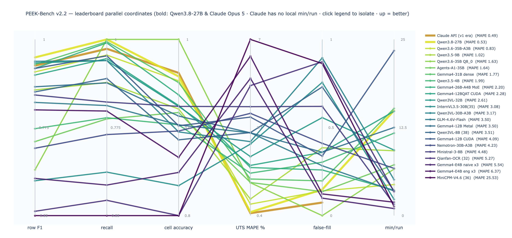
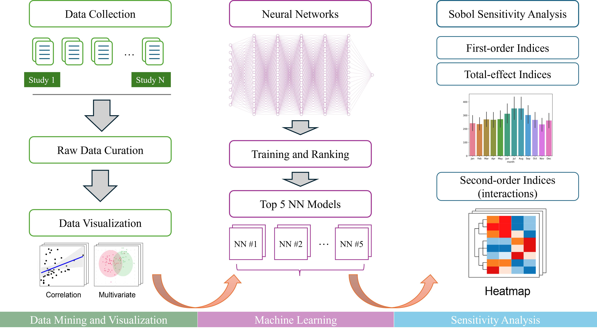
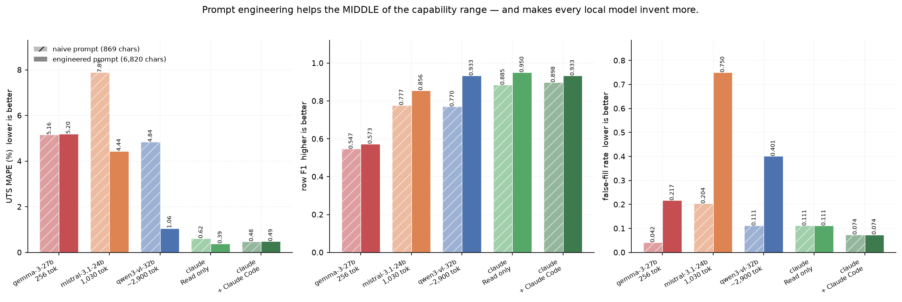

# PEEK-Bench v2

**Version 2.1** · benchmark of the multi-fleet campaign era — 30+ arms, repeat-sweep error bars,
negative results, and autonomous orchestration. Versioning: minor releases (v2.1, v2.2, …) will
track result refreshes and added arms; major releases (v3, v4, …) are reserved for changes to the
task, corpus, or scoring. *v1* was the original four-model comparison (kept below as
"generation A/B" sections for provenance).


A benchmark for LLM extraction of process–property data from **figure-heavy** additive-manufacturing
papers. The task: given a PDF of an FFF/FDM carbon-fibre/PEEK study, emit one row per
printed-and-tested condition with **nine process parameters** and the **ultimate tensile strength (UTS)**.

The interesting part is not the text. It is that **a large share of the target values exist only
inside raster figures** — bar labels, swept curves, axis ticks — so the benchmark measures whether a
model can *read a chart*, not whether it can summarise prose.

## How the campaign is run

The benchmark is executed as a continuously-managed campaign: **Claude Code** (Anthropic's CLI
agent) orchestrates a two-machine fleet — a Mac Mini M4 Pro (Metal) and a Linux/CUDA box — through
model verification, staged downloads, resume-safe queue chains, per-model configuration ladders,
vision gates, runtime watchdogs, nightly pauses, and scoring. **Humans stay in the loop where it
matters**: [Huilong Fu](https://github.com/maxfu-UW) defines the benchmark, hand-builds the private
ground truth, sets the policies, and approves every arm; Prof. **Navid Zobeiry** (UW MSE)
supervises the research and methodology; [Ryan S. Hong](https://github.com/rh82-11), a UW MSE master's student,
reviews code and results. Every configuration deviation is documented in arm logs, every failure
is closed with evidence, and fabricated "model releases" are fact-checked against primary sources
before anything downloads.





*Two views of the same campaign. Above: the orchestration architecture. Below: the results as a
fan — every blade one model, blade length = row-F1, error-barred arms marked ±, and the two
models that could not drive the extraction protocol kept visible as stubs rather than deleted.*

## Results to date — full campaign leaderboard (updated 2026-08-19)

The campaign has grown far beyond the original four-model comparison: **30+ sweep arms** across
two machines, **~200 machine-hours**, repeat sweeps giving nine models between-sweep error bars
(±SD), a quant ablation, a Metal-vs-CUDA backend replication of the small-model roster, and two
fully documented negative results. All engineered-prompt, 13 dev papers × 3 repeats per sweep,
scored against the private ground truth. Ranked by numeric fidelity (UTS MAPE, lower = better):

| # | Model / arm | row F1 | recall | cell acc | UTS MAPE % | false-fill | min/run |
|---|---|---|---|---|---|---|---|
| 1 | **Claude API (v1 era)** | 0.933 | 0.976 | 0.962 | **0.49** | 0.074 | - |
| 2 | **Qwen3.8-27B** | 0.954 | 1.000 | 0.958 | **0.53** | 0.148 | 14.9 |
| 3 | Qwen3.6-35B-A3B | 0.917±0.007 | 0.960±0.014 | 0.953±0.005 | **0.83±0.20** | 0.140±0.026 | 4.4 |
| 4 | Qwen3.5-9B | 0.871±0.030 | 0.890±0.022 | 0.921±0.004 | **1.02±0.32** | 0.385±0.045 | 9.2 |
| 5 | Qwen3.6-35B Q8_0 | 0.667 | 1.000 | 1.000 | **1.63** | 0.000 | 6.6 |
| 6 | Agents-A1-35B | 0.739 | 0.797 | 0.917 | **1.64** | 0.136 | 7.2 |
| 7 | Gemma4-31B dense | 0.936 | 0.994 | 0.951 | **1.77** | 0.197 | 15.2 |
| 8 | Qwen3.5-4B | 0.772±0.042 | 0.800±0.053 | 0.903±0.003 | **1.99±0.17** | 0.303±0.013 | 11.7 |
| 9 | Gemma4-26B-A4B MoE | 0.926±0.004 | 0.991±0.007 | 0.937±0.002 | **2.20±0.21** | 0.259±0.064 | 3.6 |
| 10 | Gemma4-12BQAT CUDA | 0.909±0.011 | 0.951±0.010 | 0.925±0.010 | **2.28±0.36** | 0.359±0.017 | 14.8 |
| 11 | Qwen3VL-32B | 0.940 | 0.946 | 0.924 | **2.61** | 0.556 | 9.3 |
| 12 | InternVL3.5-30B(35) | 0.639 | 0.661 | 0.834 | **3.08** | 0.756 | 2.3 |
| 13 | Qwen3VL-30B-A3B | 0.944±0.017 | 0.946±0.023 | 0.895±0.005 | **3.17±0.52** | 0.895±0.033 | 5.1 |
| 14 | GLM-4.6V-Flash | 0.839±0.055 | 0.831±0.048 | 0.903±0.007 | **3.50±0.46** | 0.283±0.019 | 3.5 |
| 15 | Gemma4-12B Metal | 0.879 | 0.889 | 0.913 | **3.50** | 0.360 | 12.5 |
| 16 | Qwen3VL-8B (38) | 0.866±0.010 | 0.900±0.024 | 0.886±0.007 | **3.51±0.68** | 0.730±0.033 | 3.5 |
| 17 | Gemma4-12B CUDA | 0.926 | 0.958 | 0.902 | **4.09** | 0.338 | 23.4 |
| 18 | Nemotron-30B-A3B | 0.722 | 0.757 | 0.896 | **4.23** | 0.410 | 6.7 |
| 19 | Ministral-3-8B | 0.858±0.025 | 0.840±0.031 | 0.924±0.003 | **4.48±0.72** | 0.620±0.011 | 1.6 |
| 20 | Qianfan-OCR (32) | 0.561 | 0.589 | 0.761 | **5.27** | 0.873 | 3.4 |
| 21 | Gemma4-E4B naive x3 | 0.645±0.005 | 0.628±0.005 | 0.849±0.010 | **5.54±1.10** | 0.099±0.020 | 1.0 |
| 22 | Gemma4-E4B eng x3 | 0.820±0.007 | 0.817±0.020 | 0.866±0.014 | **6.37±1.57** | 0.123±0.016 | 1.9 |
| 23 | MiniCPM-V4.6 (36) | 0.346 | 0.332 | 0.660 | **25.53** | 0.863 | 1.3 |

**Explore the leaderboard interactively** — parallel-coordinates view (brush any axis,
reorder axes by dragging; hosted via GitHub Pages):

[](https://maxfu-uw.github.io/peek-bench/interactive/leaderboard.html)

**Headline (v2.2): a 3-day-old free local model caught the frontier API.** Qwen3.8-27B
(released 2026-08-14, Apache-2.0, 19 GB Q4 on a Mac Mini) scored **F1 0.954 / recall 1.000 /
MAPE 0.53** — beating the campaign's Claude Opus 5 API arm (F1 0.933 / recall 0.976 / MAPE 0.49)
on row-finding while matching its numeric fidelity within noise. The v1 finding ("the frontier
API is 2.7x more accurate than the best local model") no longer holds. *Caveats: single sweeps
on both sides; the Claude arm is v1-era; repeat sweeps for error bars are planned.*

**Key findings so far**

- **Best numeric fidelity:** Qwen3.6-35B-A3B — MAPE **0.83 ± 0.20 %** across three sweeps, with the
  lowest false-fill on the board and ~4 min/run (MoE decode). The best trust-per-minute extractor.
- **Best row-finding:** Qwen3-VL-32B (F1 0.940) and Gemma4-31B (F1 0.936, recall 0.994) — dense
  models still hold the F1 crown, at 3-4× the runtime of their MoE rivals.
- **F1 and MAPE rank models differently** — finding rows and transcribing numbers correctly are
  close to independent skills, which is why the benchmark reports both.
- **Reproducibility:** F1 is stable between sweeps (top models ±0.004-0.017); MAPE wobbles more
  (±0.2-1.6) — single-sweep MAPE claims should be treated with caution.
- **Negative results, kept visible:** EXAONE-4.5-33B (thinking-default output never drives the
  agentic protocol; both thinking modes tested) and Fara1.5-9B (a GUI computer-use agent; perfect
  probe on the easiest paper, F1 0.009 at corpus scale). A GUI agent is not a literature-mining
  agent, and reasoning-heavy output styles can be protocol-incompatible.
- **Engine caveats are part of the result:** Nemotron-30B's score is a lower bound (llama.cpp
  fixed-256-token image projector bug); InternVL3.5 closed at 35/39 after context-exhaustion and
  view-loop failures; per-arm config deviations are documented in the campaign logs.

*Sections below marked "generation A/B" are the original early-phase results, kept for
provenance; the table above supersedes them as the campaign summary.*

## Why this benchmark exists

This benchmark's authors have built a dataset like this by hand before: a manually curated
process–property dataset of **pure (unreinforced) PEEK** studies, assembled for a machine-learning
meta-analysis of polymer additive manufacturing (Fu & Zobeiry, 2026). Curating it — reading each
paper, locating every printed-and-tested condition, transcribing values that often exist only inside
figures — took **months of expert time**. PEEK-Bench applies the same curation discipline to a new
**carbon-fibre PEEK** corpus and asks, with a scored instrument, whether an LLM can absorb that
labour. The two datasets are distinct: the 2026 paper's pure-PEEK data is *not* the ground truth
used here.

> Fu, H., & Zobeiry, N. (2026). Data-driven machine learning meta-analysis of process–property
> relationships in polymer additive manufacturing. *Journal of Manufacturing Processes, 163*,
> 100–113. https://doi.org/10.1016/j.jmapro.2026.02.044
>
> 



*The workflow behind that predecessor study (figure from Fu & Zobeiry, 2026). Its left column —
collecting studies and hand-curating the raw data — is the months-of-expert-time stage PEEK-Bench
measures the automation of; every downstream stage is only as good as that input.*

**Status: the 13-paper development sweep using 3 local LLM models is COMPLETE — 117/117 runs, all papers under one frozen
prompt, 12 h 24 min. The frozen 10-paper test split has not been started.**

---

## Corpus

| | papers | UTS datapoints |
|---|---|---|
| **dev** | 13 | 113 |
| **test** (frozen, unrun) | 10 | 119 |
| **total** | 23 | 232 |

Ground truth is a curated spreadsheet, **not distributed in this repo**. It is pre-imputation: a
blank means *the paper does not report it*, so `null` is the correct answer and inventing a
plausible default is a scored error (`false_fill_rate`).

## Models

**v2 roster — 19 vision-language models** (plus quant/backend/prompt variants → 30+ sweep arms),
run locally on a Mac Mini M4 Pro 64 GB (Metal) and a Linux box with an RTX A2000 12 GB (CUDA),
via `llama-server` (llama.cpp, pinned build per arm; LM Studio in the v1 era).

| family | models benchmarked | image tokens/page |
|---|---|---|
| Google Gemma | gemma-3 4B/12B/27B · gemma-4 E4B/12B (+QAT, Metal+CUDA)/26B-A4B MoE/31B | **268** (fixed) |
| Alibaba Qwen | Qwen3-VL 8B/30B-A3B/32B · Qwen3.5 4B/9B · Qwen3.6-35B-A3B | 990–2,900 (dynamic, capped 1,024) |
| Others | InternVL3.5-30B-A3B · Nemotron-Omni-30B-A3B · GLM-4.6V-Flash · Ministral-3-8B · Mistral-Small-3.1 | mixed |
| Negative results | EXAONE-4.5-33B · Fara1.5-9B (documented, kept visible) | — |
| In flight | Muse Glimmer 30B · Agents-A1-35B · NuExtract3 · Qianfan-OCR · MiniCPM-V-4.6 · DeepSeek-OCR-2 · Q8 ablation | — |

Image-token budgets were **measured**, not read from documentation: send an identical prompt with
and without a page image and diff `prompt_tokens`. Every qualitative probe we tried ("can you read
this chart?") gave the wrong answer at least once; the token delta never did.

---

## Three experiment generations — read the labels

Generation **A** (early per-paper probes) and **B** (the first complete dev-13 sweeps) are the
v1 record of how the harness matured — both archived in [docs/v1_results.md](docs/v1_results.md).
Generation **C** is the fleet campaign summarized in the leaderboard above: 30+ arms, repeat
sweeps with error bars, config ladders, and documented negative results.

This repo contains results from **two separate runs**, and the same model appears in both with
different numbers. They are not interchangeable:

| | papers | prompt | status |
|---|---|---|---|
| **A. Early per-paper runs** | CF-P11, P13, P18, P19 | **mixed versions**, changed mid-campaign | complete, superseded |
| **B. Dev-13 sweep** | all 13 dev papers | **one frozen version** | **complete — 117/117** |

**Generation B supersedes A** for any model comparison. A is retained because it contains the
supplementary-information A/B and the early figure/table contrast, which B does not repeat.
Every table below states which generation it comes from.

## Runtime economics — MoE broke the accuracy-costs-time trade-off

The v1 finding was "the most accurate model is the slowest." v2 overturned it: decode cost tracks
**active** parameters, so mixture-of-experts models deliver top-tier accuracy at small-model
speed. From the leaderboard's `min/run` column (same protocol, host-specific timings):
Gemma4-26B-A4B MoE **3.6 min/run** at F1 0.926 and Qwen3.6-35B-A3B **4.4 min/run** at the best
MAPE on the board — versus 15.2 min for dense Gemma4-31B and 9.3 for dense Qwen3-VL-32B at
comparable accuracy. On bandwidth-bound consumer hardware the MoE dividend is 3–5× wall-clock.
The v1 three-model timing table is archived in [docs/v1_results.md](docs/v1_results.md).

## Second finding: benchmark scoring is where the bugs are

Six defects were found in the scorer itself, several of which **inverted the model ranking** —
i.e. the benchmark rewarded worse extraction. Two examples:

- A run that emitted **21 rows with every `tensile_strength` null** scored the paper's *best*
  row-F1 (0.895), beating a run with 52 rows at 47 % UTS accuracy. Rows aligned on input
  parameters alone, so identifying conditions while reporting no measurements won.
- On CF-P18 a model that transcribed the chart **perfectly** scored 0.364 while one returning three
  rows with values wrong by 8–13 MPa scored 0.800 — because correctly-read-but-curator-excluded
  conditions counted as hallucinations.

Every one of these was found by an adversarial pass that re-derived numbers from primary sources,
and each is documented with its reproduction in [docs/scoring-defects.md](docs/scoring-defects.md).
This is arguably the most transferable output of the project: **the metric, not the model, was the
dominant error source.**

---

## Workflow

```
PDF ──► render pages (text + JPEG)
     ──► agentic loop:  view_page(n) / note(text) / submit(rows)
     ──► rows JSON ──► Hungarian alignment vs GT ──► metrics workbook
```

The harness serves the **complete text of every page up front** and page **images on demand**.
That asymmetry is deliberate: text is ~1 token per 4 characters, while one page image costs 256 to
~2,900 tokens. An earlier version capped page text at 1,500 characters and silently hid the
methods section, and both models scored 0/18 on exactly the parameters stated there.

Prefix caching makes the agentic loop **faster** than single-pass (measured 0.73× / 0.77× wall
clock), because the growing conversation prefix is reused across turns.

See [docs/methodology.md](docs/methodology.md) for the scoring rules, the alignment design, and the
two scope mechanisms (`paper_scope.json`, `out_of_scope.json`) that keep undisclosed curation
decisions from being charged to the model.

## MCP server and Skill

`mcp_server/peek_bench_mcp.py` serves the corpus and scores submissions **without exposing ground
truth** — `submit_extraction` returns metrics only, so a held-out split can be evaluated without
being consumed. Tools: `list_papers`, `get_paper_text`, `get_page_image` (native resolution),
`get_scope_note`, `get_answerability`, `submit_extraction`. Submissions are logged with a row hash,
because unlimited scored submissions turn a test split into a training signal.

`skills/peek-extract/SKILL.md` packages the extraction protocol: inclusion criteria, all ten field
disambiguations, the eight rules, and the five traps actually observed in this corpus.

> Note: do **not** name the server directory `mcp/` — it shadows the installed `mcp` package and
> `import mcp.server` will fail.

## Prompt-engineering ablation — naive baseline

*(v2 confirmation: repeated ×3 per arm on gemma-4-E4B — engineered 0.820±0.007 vs naive
0.645±0.005 row-F1; a +0.175 gap ≈ 25 between-sweep SDs. The v1 finding below replicated.)*

How much of the result comes from the *prompt* rather than the model? Every configuration was
re-run with a **869-character prompt** — what a first-time user would type: the ten column names
with units, "use null if a value isn't given", nothing else. No inclusion criteria, no field
disambiguations, no rules, no per-paper scope notes. Verbatim in
[docs/prompt_naive.txt](docs/prompt_naive.txt); the engineered prompt is 6,820 characters.



| configuration | img tok | row F1 | | cell acc | | UTS MAPE | | false-fill | |
|---|---|---|---|---|---|---|---|---|---|
| | | naive | eng | naive | eng | naive | eng | naive | eng |
| gemma-3-27b | 256 | 0.547 | 0.573 | **0.859** | 0.798 | 5.16 | 5.20 | **0.042** | 0.217 |
| mistral-small-3.1 | 1,030 | 0.777 | 0.856 | 0.855 | 0.906 | 7.89 | **4.44** | **0.204** | 0.750 |
| qwen3-vl-32b | ~2,900 | 0.770 | **0.933** | 0.853 | **0.927** | 4.84 | **1.06** | **0.111** | 0.401 |
| claude Read-only | native | 0.885 | **0.950** | 0.923 | **0.963** | 0.62 | 0.39 | 0.111 | 0.111 |
| claude + Claude Code | native | 0.898 | 0.933 | 0.930 | **0.962** | 0.48 | 0.49 | 0.074 | 0.074 |

Paired Wilcoxon by paper, n = 13:

| configuration | row F1 | cell acc | UTS MAPE |
|---|---|---|---|
| gemma-3-27b | 0.898 | 0.156 | 0.688 |
| mistral-small-3.1 | 0.389 | 0.055 | **0.020** |
| qwen3-vl-32b | **0.023** | **0.014** | 0.156 |
| claude Read-only | 0.625 | **0.031** | 0.500 |
| claude + Claude Code | 0.625 | **0.031** | 1.000 |

### Prompt engineering helps the MIDDLE of the capability range

**gemma gains nothing significant on any metric.** It cannot execute the rules reliably enough for
them to matter. **claude gains only cell accuracy** (+0.03–0.04) — it avoids the traps unprompted:
given the naive prompt it still returned `null` for `infill_percentage` on the paper that says
*"extrusion flow of 100 %"*, still dropped the glass-fibre rows, and filled **0 of 34** blank cells
with conventional defaults.

**qwen is the biggest beneficiary** — row F1 0.770 → 0.933, cell 0.853 → 0.927, both significant.
Capable enough to follow the rules, not capable enough to derive them.

### Every local model invents more when engineered

False-fill rises **5.2×** (gemma), **3.7×** (mistral), **3.6×** (qwen). Mistral fabricates a value
in **75 %** of the cells its paper leaves blank. Claude's rate is *identical* in both conditions
(0.111 / 0.074) — it does not respond to that pressure at all.

The "extract EVERY qualifying condition" rule buys coverage and pays for it in fabrication. A
MAPE-only comparison hides this entirely, and it is only visible because ground truth is
pre-imputation.

### Non-termination: a claim withdrawn

**4 of 39** local naive runs failed to terminate within 5× their engineered-prompt time
(CF-P11 × mistral, and CF-P24 / CF-P11 / CF-P13 × qwen). During the sweep this was recorded as
*"the naive prompt causes non-termination on scope-ambiguous papers."* **That was wrong.**

On retry under a 3× cap, **all four completed** — CF-P11 × mistral went from a 3 h 38 m stall to
**5.9 min** on an identical configuration; CF-P24 × qwen needed four attempts but finished in
21.0 min. Non-termination is **intermittent**, and the correct mitigation is a timeout with retry,
not a longer prompt.

The underlying mechanism is real though, and measurable: under the naive prompt qwen emitted
**60 rows against a ground truth of 20** on CF-P24, and mistral **41**. Runtime scales with rows
emitted, so the stall and the accuracy loss are the same failure.

*Caveat: local naive is 1 repeat against 3 for engineered; the Claude rows are 3 repeats under
cwd-isolation and are the more reliable comparison.*

### Capacity at fixed perception — gemma-3 4B / 12B / 27B

Gemma 3 spends **258 image tokens per page at every size** (token-delta measured on all three), so
this varies parameters with perception held constant. One Mac Mini M4 Pro, engineered prompt,
ctx 40,960, 39 runs per sweep. **Every arm has been swept at least twice**; ± is the SD between
whole sweeps.

| model | sweeps | row F1 | recall | precision | cell | UTS MAPE |
|---|---|---|---|---|---|---|
| **4B** | 3 | 0.371 ± 0.046 | 0.336 ± 0.032 | **0.655** | 0.746 | 31.56 ± 12.41 |
| **12B** | 2 | 0.362 ± 0.105 | 0.371 ± 0.122 | 0.404 | **0.805** | 9.54 ± 1.23 |
| **27B** | 2 | **0.572** ± 0.001 | **0.645** ± 0.045 | 0.609 | 0.798 | **5.51** ± 0.44 |

UTS MAPE (31.56 → 9.54 → 5.51) and recall (0.336 → 0.371 → 0.645) are monotone in parameters. Row F1
is not — the 4B and 12B tie within error.

**Retraction.** Earlier versions of this README reported that the *4B beat the 12B* on row F1 and
recall. That rested on a single 12B sweep; a second identical sweep moved its row F1 from 0.288 to
0.437 (+52 %) and recall from 0.285 to 0.458 (+61 %). The inversion is **withdrawn** as a
single-sample artifact.

**What replaced it: reproducibility scales with model size.** Worst relative swing between identical
sweeps — **4B 74.1 %** (UTS MAPE), **12B 46.4 %** (recall), **27B 11.4 %** (UTS MAPE). Small models
are not merely less accurate, they are less reproducible, so a fixed repeat protocol is
under-powered at the small end. And F1 can conceal it: across the 27B's two sweeps recall fell 9.5 %
while precision rose 11.4 %, leaving row F1 at 0.573 → 0.571.

Full detail, the metric-stability table and the fixes in
[docs/capacity-curve.md](docs/capacity-curve.md).

The six failure modes these runs exposed — grid-filling, rows with no measurement, severe
under-extraction, chart-reading collapse on swept curves, intermittent non-termination, and
fabrication under coverage pressure — are catalogued with the supporting data in
[docs/failure-modes.md](docs/failure-modes.md).

## Reproducing a run

See **[RUNNING.md](RUNNING.md)** for the full setup, and **[docs/prompt.md](docs/prompt.md)** for
the verbatim prompt as sent to the model. The corpus PDFs and ground-truth spreadsheet are not
published here — you need both from the maintainer.

```bash
export PEEKBENCH_ROOT=/path/to/peek_bench_2026
export PEEKBENCH_GT_DIR=$PEEKBENCH_ROOT/group_truth_excel_file
pip install requests pymupdf pandas numpy scipy openpyxl matplotlib
nohup caffeinate -i ./runners/dev13_sweep.sh &    # 117 runs, ~11 h on an M4 Pro
python runners/progress.py                         # live progress + metrics
```

## Layout

*(v2 additions: `docs/figures/campaign_orchestration.svg`, `campaign_fan.svg`,
`parcoords_preview.png`; `docs/interactive/leaderboard.html` — served via GitHub Pages.)*

```
harness/     extract10.py       agentic extractor (view_page / note / submit)
             calibration/       page rendering + action parsing (imported by extract10)
scoring/     score10.py         Hungarian alignment + metrics
             schema10.json      12 fields with per-field disambiguations
             paper_scope.json   per-paper scope notes (2 papers)
             out_of_scope.json  conditions excluded by the curator (1 paper)
             audit_findability.py  per-cell answerability audit
runners/     *.sh               campaign scripts; progress.py live progress bar
results/     *.xlsx             scored metrics: summary + per_column sheets only
                                (stamped with the GT filename and md5 they were scored against)
paper_drafts/ PEEK-Bench-draft-v2.pdf/.docx  machine-assisted paper draft (NOT peer reviewed)
             README.md          how it was produced and what it deliberately omits
docs/        prompt.md          the VERBATIM prompt, regenerable and diffable
             failure-modes.md   six catalogued failure modes with the data behind each
             capacity-curve.md  gemma-3 4B/12B/27B at fixed image tokens + MAPE instability
             methodology, metrics, findings, scoring defects, next steps
             figures/           bar charts, regenerate with `python make_figures.py`
```

**The ground truth and the source PDFs are not in this repo** — they are the curated research
dataset. The workbooks therefore carry metrics only (`summary`, `per_column`); the sheets holding
ground-truth values were removed before publication.

Reproducing the extraction requires the ground-truth spreadsheet. Set `PEEKBENCH_GT_DIR` to a directory containing
`PEEK2-CF-main-*-peekbench-v*.xlsx`; the scorer resolves the highest version and stamps its name and
MD5 into every workbook, so a result can always be traced to the GT it was scored against.

## Next steps

Updated for v2 (2026-08-13):

1. **Finish the in-flight arms** — explorer queue (Muse Glimmer, Agents-A1, NuExtract3,
   Qianfan-OCR, MiniCPM-V-4.6, DeepSeek-OCR-2) and the Qwen3.6-35B **Q8-vs-Q4 quant ablation**;
   fold results into the leaderboard as **v2.1**.
2. **Frozen test-split run** for the top tier (Qwen3.6-35B, Qwen3-VL-32B, Gemma4-31B,
   Qwen3-VL-30B-A3B) — the v1 plan, now with the roster the dev split actually selected.
3. **Consolidated scoring workbooks + paper draft** — metrics-only, per the privacy rule
   (ground truth and source PDFs are never published).
4. **Hardware**: the A2000's 12 GB is the fleet bottleneck; the evaluated upgrade path is a used
   RTX 3090 24 GB (see campaign notes) if test-split scale demands it.
5. **Serve the benchmark over MCP / package Skills** — carried over from v1, unchanged.

## Campaign accounting (v2)

Measured from run artefacts on disk, 2026-08-13: **2,383 scored runs · ~200 machine-hours**
across the Mac Mini M4 Pro (Metal) and the RTX A2000 box (CUDA), tracked live by the campaign's
master progress bar. Cost per marginal model has fallen steadily as orchestration matured —
a new model now costs one verification workflow, one download, and one queued sweep (~2–13 h of
unattended machine time depending on size class). The full v1 cost breakdown (24.8 h for the
original three-model benchmark, with per-split analysis) is archived in
[docs/v1_results.md](docs/v1_results.md).
