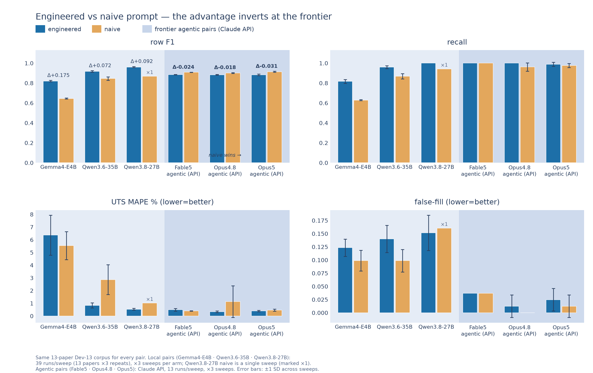
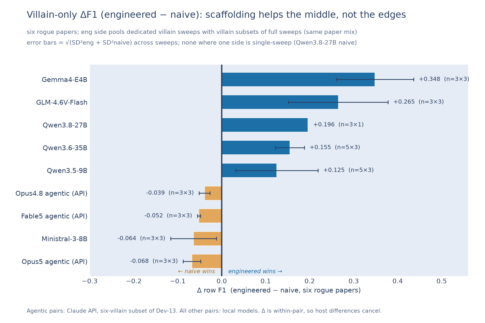
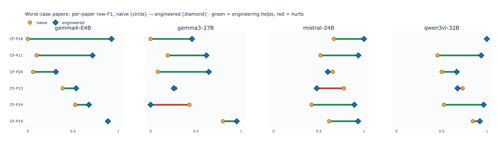
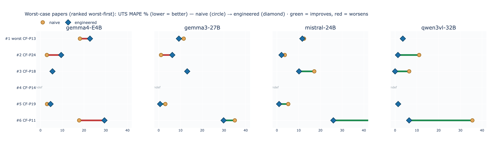
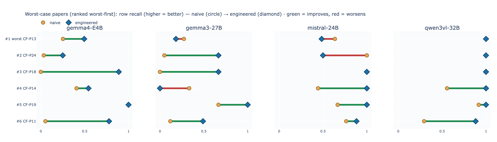
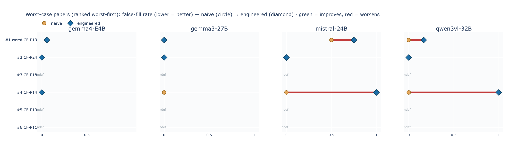

# PEEK-Bench v2

**Version 2.3** · benchmark of the multi-fleet campaign era — 35+ arms, repeat-sweep error bars,
a complete three-model frontier-API matrix, negative results, and autonomous orchestration. Versioning: minor releases (v2.1, v2.2, …) will
track result refreshes and added arms; major releases (v3, v4, …) are reserved for changes to the
task, corpus, or scoring. *v1* was the original four-model comparison (kept below as
"generation A/B" sections for provenance).


A benchmark for LLM extraction of process–property data from **figure-heavy** additive-manufacturing
papers. The task: given a PDF of an FFF/FDM carbon-fibre/PEEK study, emit one row per
printed-and-tested condition with **nine process parameters** and the **ultimate tensile strength (UTS)**.

The interesting part is not the text. It is that **a large share of the target values exist only
inside raster figures** — bar labels, swept curves, axis ticks — so the benchmark measures whether a
model can *read a chart*, not whether it can summarise prose.

## How the campaign is run

The benchmark is executed as a continuously-managed campaign: **Claude Code** (Anthropic's CLI
agent) orchestrates a two-machine fleet — a Mac Mini M4 Pro (Metal) and a Linux/CUDA box — through
model verification, staged downloads, resume-safe queue chains, per-model configuration ladders,
vision gates, runtime watchdogs, nightly pauses, and scoring. **Humans stay in the loop where it
matters**: [Huilong Fu](https://github.com/maxfu-UW) defines the benchmark, hand-builds the private
ground truth, sets the policies, and approves every arm; Prof. **Navid Zobeiry** (UW MSE)
supervises the research and methodology; [Ryan S. Hong](https://github.com/rh82-11), a UW MSE master's student,
reviews code and results. Every configuration deviation is documented in arm logs, every failure
is closed with evidence, and fabricated "model releases" are fact-checked against primary sources
before anything downloads.


*Two views of the same campaign. Above: the orchestration architecture. Below: the results as a
fan — every blade one arm, blade length = numeric fidelity (inverse UTS-MAPE), between-sweep
whiskers on repeated arms, gold blades the Claude API arms, and the two models that could not
drive the extraction protocol kept visible as stubs rather than deleted.*

## Results to date — full campaign leaderboard (updated 2026-08-29)

The campaign has grown far beyond the original four-model comparison: **35+ sweep arms** across
two machines and a frontier-API tier, **~3,900 scored runs / ~330 local machine-hours**, repeat
sweeps giving twenty arms between-sweep error bars (±SD), a quant ablation, a Metal-vs-CUDA
backend replication of the small-model roster, and four fully documented negative results.
13 dev papers × 3 repeats per sweep (Claude agentic arms: 13 runs per sweep), scored against the
private ground truth. Engineered prompt unless the arm says **NAIVE**; the six **agentic** arms
are Claude models driving the same protocol through the Claude Code harness. Ranked by numeric
fidelity (UTS MAPE, lower = better):

| # | Model / arm | row F1 | recall | cell acc | UTS MAPE % | false-fill | min/run |
|---|---|---|---|---|---|---|---|
| 1 | **Claude Opus 4.8 agentic (eng)** | 0.883±0.003 | 1.000±0.000 | 0.973±0.004 | **0.33±0.06** | 0.012±0.021 | - |
| 2 | **Claude Opus 5 agentic (eng)** | 0.883±0.008 | 0.988±0.020 | 0.969±0.001 | **0.39±0.06** | 0.025±0.021 | - |
| 3 | **Claude Fable 5 agentic (naive)** | 0.908±0.000 | 1.000±0.000 | 0.980±0.002 | **0.40±0.01** | 0.037±0.000 | - |
| 4 | **Claude Opus 5 agentic (naive)** | 0.914±0.004 | 0.977±0.020 | 0.976±0.002 | **0.46±0.08** | 0.012±0.021 | - |
| 5 | Claude Opus 5 API (v1 era) | 0.933 | 0.976 | 0.962 | **0.49** | 0.074 | - |
| 6 | Claude Fable 5 agentic (eng) | 0.885±0.002 | 1.000±0.000 | 0.974±0.006 | **0.49±0.10** | 0.037±0.000 | - |
| 7 | **Qwen3.8-27B** | 0.961±0.006 | 1.000±0.000 | 0.958±0.001 | **0.53±0.06** | 0.152±0.033 | 14.9 |
| 8 | Qwen3.6-35B Q8_0 | 0.939 | 0.995 | 0.956 | **0.77** | 0.148 | 4.8 |
| 9 | Qwen3.6-35B-A3B | 0.917±0.007 | 0.960±0.014 | 0.953±0.005 | **0.83±0.20** | 0.140±0.026 | 4.4 |
| 10 | Qwen3.5-9B | 0.871±0.030 | 0.890±0.022 | 0.921±0.004 | **1.02±0.32** | 0.385±0.045 | 9.2 |
| 11 | Qwen3.8-27B NAIVE | 0.869 | 0.942 | 0.939 | **1.02** | 0.160 | 11.5 |
| 12 | Claude Opus 4.8 agentic (naive) | 0.901±0.005 | 0.961±0.041 | 0.962±0.006 | **1.13±1.25** | 0.000±0.000 | - |
| 13 | Agents-A1-35B | 0.739 | 0.797 | 0.917 | **1.64** | 0.136 | 7.2 |
| 14 | Gemma4-31B dense | 0.936 | 0.994 | 0.951 | **1.77** | 0.197 | 15.2 |
| 15 | Qwen3.5-4B | 0.772±0.042 | 0.800±0.053 | 0.903±0.003 | **1.99±0.17** | 0.303±0.013 | 11.7 |
| 16 | Gemma4-26B-A4B MoE | 0.926±0.004 | 0.991±0.007 | 0.937±0.002 | **2.20±0.21** | 0.259±0.064 | 3.6 |
| 17 | Muse Glimmer 30B | 0.843 | 0.941 | 0.915 | **2.23** | 0.210 | 8.5 |
| 18 | Gemma4-12BQAT CUDA | 0.909±0.011 | 0.951±0.010 | 0.925±0.010 | **2.28±0.36** | 0.359±0.017 | 14.8 |
| 19 | Qwen3.6-35B NAIVE | 0.846±0.017 | 0.869±0.027 | 0.921±0.011 | **2.86±1.17** | 0.099±0.021 | 2.2 |
| 20 | Qwen3VL-32B | 0.938±0.007 | 0.961±0.014 | 0.924±0.005 | **2.92±0.30** | 0.549±0.010 | 8.3 |
| 21 | InternVL3.5-30B(35) | 0.639 | 0.661 | 0.834 | **3.08** | 0.756 | 2.3 |
| 22 | Qwen3VL-30B-A3B | 0.944±0.017 | 0.946±0.023 | 0.895±0.005 | **3.17±0.52** | 0.895±0.033 | 5.1 |
| 23 | GLM-4.6V-Flash | 0.839±0.055 | 0.831±0.048 | 0.903±0.007 | **3.50±0.46** | 0.283±0.019 | 3.5 |
| 24 | Gemma4-12B Metal | 0.879 | 0.889 | 0.913 | **3.50** | 0.360 | 12.5 |
| 25 | Qwen3VL-8B (38) | 0.866±0.010 | 0.900±0.024 | 0.886±0.007 | **3.51±0.68** | 0.730±0.033 | 3.5 |
| 26 | Gemma4-12B CUDA | 0.926 | 0.958 | 0.902 | **4.09** | 0.338 | 23.4 |
| 27 | Nemotron-30B-A3B | 0.722 | 0.757 | 0.896 | **4.23** | 0.410 | 6.7 |
| 28 | Ministral-3-8B | 0.858±0.025 | 0.840±0.031 | 0.924±0.003 | **4.48±0.72** | 0.620±0.011 | 1.6 |
| 29 | Qianfan-OCR (32) | 0.561 | 0.589 | 0.761 | **5.27** | 0.873 | 3.4 |
| 30 | Gemma4-E4B naive x3 | 0.645±0.005 | 0.628±0.005 | 0.849±0.010 | **5.54±1.10** | 0.099±0.020 | 1.0 |
| 31 | Gemma4-E4B eng x3 | 0.820±0.007 | 0.817±0.020 | 0.866±0.014 | **6.37±1.57** | 0.123±0.016 | 1.9 |
| 32 | MiniCPM-V4.6 (36) | 0.346 | 0.332 | 0.660 | **25.53** | 0.863 | 1.3 |

*Parenthesised counts — e.g. InternVL3.5-30B(35) — are arms that closed below 39 runs after
documented failures; the Claude agentic arms are 13 runs per sweep (one per paper, the harness's
own repeat protocol) and report no min/run because API wall-clock is not comparable to local
serving. Sweeps cut short by the 35-minute run ceiling are aggregated at reduced n and noted in
the campaign logs.*

**Explore the leaderboard interactively** — parallel-coordinates view (brush any axis,
reorder axes by dragging; hosted via GitHub Pages):

[](https://maxfu-uw.github.io/peek-bench/interactive/leaderboard.html)

**Headline (v2.3): a 3-day-old free local model caught the frontier API.** Qwen3.8-27B
(released 2026-08-14, Apache-2.0, 19 GB Q4 on a Mac Mini) scored **F1 0.961±0.006 / recall
1.000±0.000 / MAPE 0.53±0.06** across three full sweeps — beating every Claude arm on
row-finding while sitting within noise of them on numeric fidelity. The v1 finding ("the
frontier API is 2.7x more accurate than the best local model") no longer holds.

**The frontier matrix is complete — three models (2026-08-29).** Six agentic arms — **Claude
Fable 5**, **Claude Opus 4.8**, and **Claude Opus 5 (1M)**, each under both the engineered and
the naive prompt, three sweeps each on Dev-13 — replace the single v1-era Claude datapoint
with a full matrix:

- **Claude Opus 4.8 (eng)** sets the campaign's best-ever numeric fidelity: **MAPE 0.33±0.06 %**
  with near-zero false-fill (0.012±0.021) and perfect recall; Opus 5 (eng) is second at
  0.39±0.06.
- **Claude Opus 5 (naive)** is the best frontier row-finder: F1 **0.914±0.004**, with the
  villain-subset crown as well (0.814±0.009).
- **All three frontier models score *higher* F1 under the naive prompt than the engineered
  one** (Opus 5: 0.914 vs 0.883; Fable 5: 0.908 vs 0.885; Opus 4.8: 0.901 vs 0.883) — see the
  prompt-ablation section for why this inversion is the campaign's most interesting
  prompt-engineering result.
- **The engineered scaffolding acts as an equalizer at the frontier**: the three engineered
  arms are statistically pinned together (0.883 / 0.885 / 0.883) while the naive arms
  differentiate the models (0.901 / 0.908 / 0.914). Under the engineered prompt you cannot
  tell the frontier models apart on row-finding; under the naive prompt you can.
- The local champion **Qwen3.8-27B still out-F1s every frontier arm** (0.961 vs 0.914); the
  frontier arms win on MAPE, false-fill discipline, and cell accuracy.

*Attribution note: the v1-era arm ran claude-opus-5 under the older API harness. The v2
agentic arms ran on Claude Fable 5, Claude Opus 4.8 (the orchestration harness's "opus" tier
resolves to Opus 4.8; verified from the runs themselves and relabeled accordingly), and — via
explicit model routing — genuine Claude Opus 5 1M.*

*The naive-prompt Qwen3.8 arm has completed (F1 0.869 full-sweep vs engineered 0.961±0.006 —
gap +0.092; an earlier partial-sweep note here called it "the largest eng-vs-naive gap yet",
which the completed sweep does not support: gemma4-E4B's +0.175 and qwen3vl-32B's v1-era +0.164
are larger). Villain-only repeat sweeps for eight model pairs have landed — see the
prompt-ablation section.*

**Key findings so far**

- **Best numeric fidelity:** Claude Opus 4.8 agentic (eng) — MAPE **0.33±0.06 %** with near-zero
  false-fill. Best *local* fidelity: Qwen3.8-27B (0.53±0.06) and Qwen3.6-35B-A3B (0.83±0.20, ~4
  min/run MoE decode — still the best trust-per-minute extractor).
- **Best row-finding:** Qwen3.8-27B (F1 0.961±0.006) — a local model holds the F1 crown,
  0.047 clear of the best frontier arm (Opus 5 naive, 0.914±0.004); among the rest,
  Qwen3VL-30B-A3B (0.944±0.017), the Qwen3.6-35B Q8 ablation (0.939) and Qwen3-VL-32B
  (0.938±0.007) lead.
- **Prompt engineering inverts at the frontier — three for three:** all three Claude models
  score higher F1 under the naive prompt than the engineered one (Opus 5 shows the largest
  within-model gap, −0.031), while every mid-range local model still needs the scaffolding
  (details in the prompt-ablation section).
- **F1 and MAPE rank models differently** — finding rows and transcribing numbers correctly are
  close to independent skills, which is why the benchmark reports both.
- **Reproducibility:** F1 is stable between sweeps (top models ±0.004-0.017); MAPE wobbles more
  (up to ±1.6) — single-sweep MAPE claims should be treated with caution.
- **Negative results, kept visible:** EXAONE-4.5-33B (thinking-default output never drives the
  agentic protocol; both thinking modes tested), Fara1.5-9B (a GUI computer-use agent; perfect
  probe on the easiest paper, F1 0.009 at corpus scale), and two all-zero config ladders —
  NuExtract3-4.8B and DeepSeek-OCR-2 — where no serving configuration produced a single scored
  row. A GUI agent is not a literature-mining agent, and reasoning-heavy or OCR-specialized
  output styles can be protocol-incompatible.
- **Engine caveats are part of the result:** Nemotron-30B's score is a lower bound (llama.cpp
  fixed-256-token image projector bug); InternVL3.5 closed at 35/39 after context-exhaustion and
  view-loop failures; per-arm config deviations are documented in the campaign logs.

*Sections below marked "generation A/B" are the original early-phase results, kept for
provenance; the table above supersedes them as the campaign summary.*

## Which papers do the discriminating — a per-paper difficulty autopsy

Aggregated across the 12 strongest arms (36 runs per paper), the dev-13 corpus splits cleanly
into papers every competitive model aces and a small rogues' gallery that produces nearly all
of the benchmark's discriminative signal — confirming, at fleet scale, the corpus-sensitivity
finding of the validity audit (§7 of the paper draft).

**The angels:** CF-P02, CF-P04, CF-P10, CF-P20 — F1 1.000 and MAPE 0.00 on all 36 runs each.
They contribute confidence, not discrimination.

**The rogues' gallery** (best/worst UTS-MAPE across the 12 arms):

| rank Paper | F1 mean | worst F1 run | best MAPE (model) | worst MAPE (model) | median | ceiling kills | Failure axis |
|---|---|---|---|---|---|---|---|
| **#1** CF-P13 | 0.609 | 0.000 | 1.34% (Gemma4-31B) | 39.13% (Ministral-8B) | 3.89 | 17 | length: 21 pages — context exhaustion, engine wedges, timeouts |
| **#2** CF-P24 | 0.684 | 0.000 | 0.67% (Qwen3.6-35B) | 13.99% (Gemma4-12B) | 3.34 | 8 | protocol: induces view-loop spiraling regardless of length |
| **#3** CF-P18 | 0.837 | 0.667 | 0.00% (Qwen3.5-9B) | 29.91% (Ministral-8B) | 6.33 | 0 | figures: raster bar labels — a near-binary 0-or-30 chart-reading switch |
| **#4** CF-P14 | 0.845 | 0.000 | — (sorted: 1.35%) | — (sorted: 3.97%) | — | 7 | **schema-degenerate**: row-aligned MAPE refused by design (see disclosure below); length (21 pages) is its real difficulty |
| **#5** CF-P19 | 0.902 | 0.421 | 0.01% (Ministral-8B) | 6.55% (Muse-30B) | 0.40 | 6 | engine: shortest paper (6 pages), kills come from long-context serving configs, not content |
| **#6** CF-P11 | 0.973 | 0.588 | 1.28% (Qwen3.8-27B) | 24.83% (Gemma4-12B) | 9.70 | 0 | figures: rows found easily, values misread — worst numeric error in the corpus |

Difficulty is three independent axes — **length** (P13/P14), **figure hostility** (P11/P18,
which break MAPE while leaving F1 intact), and **protocol traps** (P24). CF-P18 is the
corpus's best single discriminator: models either transcribe its bar labels exactly or
hallucinate them wholesale. A future corpus revision should add figure-hostile papers of the
P11/P18 class and can afford to drop angels.

**CF-P14 disclosure — schema degeneracy, not model failure.** This paper's nine ground-truth
rows differ only in factors *outside* the nine-parameter extraction schema (annealing-class
variables); within the schema every row is identical, so any pairing of predicted rows to
ground-truth rows is arbitrary. Row-aligned MAPE under an arbitrary pairing would measure
output *order*, not extraction quality — a defect class identified in the validity audit — so
the scorer deliberately returns no row-aligned MAPE for this paper (`alignment_degenerate`).
The order-free replacement metric shows the paper is read accurately: sorted-UTS MAPE medians
of 1.37% (Qwen3.8-27B), 1.35% (Gemma4-31B), 2.53% (Qwen3.6-35B), 3.97% (Ministral-8B). Net
effect on the tables above: MAPE columns average over 12 papers, F1 over all 13. Documented
rather than repaired, consistent with the audit's treatment of ground-truth alignment limits.

## Why this benchmark exists

This benchmark's authors have built a dataset like this by hand before: a manually curated
process–property dataset of **pure (unreinforced) PEEK** studies, assembled for a machine-learning
meta-analysis of polymer additive manufacturing (Fu & Zobeiry, 2026). Curating it — reading each
paper, locating every printed-and-tested condition, transcribing values that often exist only inside
figures — took **months of expert time**. PEEK-Bench applies the same curation discipline to a new
**carbon-fibre PEEK** corpus and asks, with a scored instrument, whether an LLM can absorb that
labour. The two datasets are distinct: the 2026 paper's pure-PEEK data is *not* the ground truth
used here.

> Fu, H., & Zobeiry, N. (2026). Data-driven machine learning meta-analysis of process–property
> relationships in polymer additive manufacturing. *Journal of Manufacturing Processes, 163*,
> 100–113. https://doi.org/10.1016/j.jmapro.2026.02.044
>
> 


*The workflow behind that predecessor study (figure from Fu & Zobeiry, 2026). Its left column —
collecting studies and hand-curating the raw data — is the months-of-expert-time stage PEEK-Bench
measures the automation of; every downstream stage is only as good as that input.*

**Status (2026-08-29): the Dev-13 campaign is near close-out — ~3,900 scored runs across 35+
arms, three-model frontier matrix complete, villain-repeat chain finishing its last menus. The frozen
10-paper test split has not been started.**

---

## Corpus

| | papers | UTS datapoints |
|---|---|---|
| **dev** | 13 | 113 |
| **test** (frozen, unrun) | 10 | 119 |
| **total** | 23 | 232 |

Ground truth is a curated spreadsheet, **not distributed in this repo**. It is pre-imputation: a
blank means *the paper does not report it*, so `null` is the correct answer and inventing a
plausible default is a scored error (`false_fill_rate`).

## Models

**v2 roster — 23 vision-language models benchmarked plus 3 Claude API models** (quant/backend/
prompt variants → 35+ sweep arms), local models on a Mac Mini M4 Pro 64 GB (Metal) and a Linux
box with an RTX A2000 12 GB (CUDA) via `llama-server` (llama.cpp, pinned build per arm; LM
Studio in the v1 era); Claude agentic arms via the Claude Code harness.

| family | models benchmarked | image tokens/page |
|---|---|---|
| Google Gemma | gemma-3 4B/12B/27B · gemma-4 E4B/12B (+QAT, Metal+CUDA)/26B-A4B MoE/31B | **268** (fixed) |
| Alibaba Qwen | Qwen3-VL 8B/30B-A3B/32B · Qwen3.5 4B/9B · Qwen3.6-35B-A3B (+Q8 ablation) · Qwen3.8-27B | 990–2,900 (dynamic, capped 1,024) |
| Others | InternVL3.5-30B-A3B · Nemotron-Omni-30B-A3B · GLM-4.6V-Flash · Ministral-3-8B · Mistral-Small-3.1 · Muse Glimmer 30B · Agents-A1-35B · Qianfan-OCR · MiniCPM-V-4.6 | mixed |
| Claude (agentic) | Fable 5 · Opus 4.8 · Opus 5 1M (each eng + naive, ×3 sweeps) · plus the v1-era Opus 5 single sweep | native |
| Negative results | EXAONE-4.5-33B · Fara1.5-9B · NuExtract3-4.8B · DeepSeek-OCR-2 (documented, kept visible) | — |
| In flight | villain-only repeat sweeps (Muse, Gemma4-31B, Gemma3-27B, Qwen3.8 pairs) | — |

Image-token budgets were **measured**, not read from documentation: send an identical prompt with
and without a page image and diff `prompt_tokens`. Every qualitative probe we tried ("can you read
this chart?") gave the wrong answer at least once; the token delta never did.

---

## Three experiment generations — read the labels

Generation **A** (early per-paper probes) and **B** (the first complete dev-13 sweeps) are the
v1 record of how the harness matured — both archived in [docs/v1_results.md](docs/v1_results.md).
Generation **C** is the fleet campaign summarized in the leaderboard above: 35+ arms, repeat
sweeps with error bars, config ladders, and documented negative results.

This repo contains results from **two separate runs**, and the same model appears in both with
different numbers. They are not interchangeable:

| | papers | prompt | status |
|---|---|---|---|
| **A. Early per-paper runs** | CF-P11, P13, P18, P19 | **mixed versions**, changed mid-campaign | complete, superseded |
| **B. Dev-13 sweep** | all 13 dev papers | **one frozen version** | **complete — 117/117** |

**Generation B supersedes A** for any model comparison. A is retained because it contains the
supplementary-information A/B and the early figure/table contrast, which B does not repeat.
Every table below states which generation it comes from.

## Runtime economics — MoE broke the accuracy-costs-time trade-off

The v1 finding was "the most accurate model is the slowest." v2 overturned it: decode cost tracks
**active** parameters, so mixture-of-experts models deliver top-tier accuracy at small-model
speed. From the leaderboard's `min/run` column (same protocol, host-specific timings):
Gemma4-26B-A4B MoE **3.6 min/run** at F1 0.926 and Qwen3.6-35B-A3B **4.4 min/run** at the best
local-MoE MAPE on the board — versus 15.2 min for dense Gemma4-31B and 8.3 for dense
Qwen3-VL-32B at comparable accuracy. On bandwidth-bound consumer hardware the MoE dividend is
3–5× wall-clock.
The v1 three-model timing table is archived in [docs/v1_results.md](docs/v1_results.md).

## Second finding: benchmark scoring is where the bugs are

Six defects were found in the scorer itself, several of which **inverted the model ranking** —
i.e. the benchmark rewarded worse extraction. Two examples:

- A run that emitted **21 rows with every `tensile_strength` null** scored the paper's *best*
  row-F1 (0.895), beating a run with 52 rows at 47 % UTS accuracy. Rows aligned on input
  parameters alone, so identifying conditions while reporting no measurements won.
- On CF-P18 a model that transcribed the chart **perfectly** scored 0.364 while one returning three
  rows with values wrong by 8–13 MPa scored 0.800 — because correctly-read-but-curator-excluded
  conditions counted as hallucinations.

Every one of these was found by an adversarial pass that re-derived numbers from primary sources,
and each is documented with its reproduction in [docs/scoring-defects.md](docs/scoring-defects.md).
This is arguably the most transferable output of the project: **the metric, not the model, was the
dominant error source.**

---

## Workflow

```
PDF ──► render pages (text + JPEG)
     ──► agentic loop:  view_page(n) / note(text) / submit(rows)
     ──► rows JSON ──► Hungarian alignment vs GT ──► metrics workbook
```

The harness serves the **complete text of every page up front** and page **images on demand**.
That asymmetry is deliberate: text is ~1 token per 4 characters, while one page image costs 256 to
~2,900 tokens. An earlier version capped page text at 1,500 characters and silently hid the
methods section, and both models scored 0/18 on exactly the parameters stated there.

Prefix caching makes the agentic loop **faster** than single-pass (measured 0.73× / 0.77× wall
clock), because the growing conversation prefix is reused across turns.

See [docs/methodology.md](docs/methodology.md) for the scoring rules, the alignment design, and the
two scope mechanisms (`paper_scope.json`, `out_of_scope.json`) that keep undisclosed curation
decisions from being charged to the model.

## MCP server and Skill

`mcp_server/peek_bench_mcp.py` serves the corpus and scores submissions **without exposing ground
truth** — `submit_extraction` returns metrics only, so a held-out split can be evaluated without
being consumed. Tools: `list_papers`, `get_paper_text`, `get_page_image` (native resolution),
`get_scope_note`, `get_answerability`, `submit_extraction`. Submissions are logged with a row hash,
because unlimited scored submissions turn a test split into a training signal.

`skills/peek-extract/SKILL.md` packages the extraction protocol: inclusion criteria, all ten field
disambiguations, the eight rules, and the five traps actually observed in this corpus.

> Note: do **not** name the server directory `mcp/` — it shadows the installed `mcp` package and
> `import mcp.server` will fail.

## Prompt-engineering ablation — naive baseline

### Engineered vs naive — repeat-sweep comparison (updated 2026-08-29)

Six paired comparisons with repeat sweeps, same model and serving config inside each pair,
only the prompt differs. Ordered by model capability — and the ordering is the story: **the
engineered prompt's advantage is large for the weakest model, moderate for the mid-range, and
inverted at the frontier — for all three frontier models.**
(Three further v1-era single-sweep pairs — gemma3-27B, mistral-24B, qwen3vl-32B — are in the
archived table below; all three showed positive F1 deltas of +0.03 to +0.16.)



| pair | arm | row F1 | recall | UTS MAPE % | false-fill |
|---|---|---|---|---|---|
| **gemma4-E4B (×3 / ×3)** | engineered | 0.820±0.007 | 0.817±0.020 | 6.37±1.57 | 0.123±0.016 |
|  | naive | 0.645±0.005 | 0.628±0.005 | 5.54±1.10 | 0.099±0.020 |
|  | **Δ (eng−naive)** | **+0.175** | +0.188 | +0.82 | +0.024 |
| **qwen3.6-35B (×3 / ×3)** | engineered | 0.917±0.007 | 0.960±0.014 | 0.83±0.20 | 0.140±0.026 |
|  | naive | 0.846±0.017 | 0.869±0.027 | 2.86±1.17 | 0.099±0.021 |
|  | **Δ (eng−naive)** | **+0.072** | +0.092 | -2.03 | +0.041 |
| **qwen3.8-27B (×3 / ×1)** | engineered | 0.961±0.006 | 1.000±0.000 | 0.53±0.06 | 0.152±0.033 |
|  | naive | 0.869 | 0.942 | 1.02 | 0.160 |
|  | **Δ (eng−naive)** | **+0.092** | +0.058 | -0.48 | -0.009 |
| **Claude Fable 5 agentic (×3 / ×3)** | engineered | 0.885±0.002 | 1.000±0.000 | 0.49±0.10 | 0.037±0.000 |
|  | naive | 0.908±0.000 | 1.000±0.000 | 0.40±0.01 | 0.037±0.000 |
|  | **Δ (eng−naive)** | **-0.024** | +0.000 | +0.09 | +0.000 |
| **Claude Opus 4.8 agentic (×3 / ×3)** | engineered | 0.883±0.003 | 1.000±0.000 | 0.33±0.06 | 0.012±0.021 |
|  | naive | 0.901±0.005 | 0.961±0.041 | 1.13±1.25 | 0.000±0.000 |
|  | **Δ (eng−naive)** | **-0.018** | +0.039 | -0.80 | +0.012 |
| **Claude Opus 5 agentic (×3 / ×3)** | engineered | 0.883±0.008 | 0.988±0.020 | 0.39±0.06 | 0.025±0.021 |
|  | naive | 0.914±0.004 | 0.977±0.020 | 0.46±0.08 | 0.012±0.021 |
|  | **Δ (eng−naive)** | **-0.031** | +0.012 | -0.07 | +0.012 |

**How to read it:** for local models prompt engineering buys **coverage** — F1 and recall rise
in every local pair, and the gain concentrates on the corpus's hard papers (E4B ×3: ΔF1 +0.35
on the six rogues vs +0.03 on the angels; exact sign-flip permutation p=0.029 overall,
difficulty-interaction p=0.038). The costs are consistent too: engineered prompts push local
models to fill cells they should leave blank, and the MAPE column is *conditioned on matched
rows* — naive arms only score the easy rows they managed to find (a survivorship confound), so
MAPE-vs-MAPE across arms is not a like-for-like comparison. Statistical tests use per-paper
paired deltas (Wilcoxon signed-rank + exact sign-flip permutation, n=13 papers).

**The frontier inversion — three for three.** All three Claude arms score *higher* F1 naive
than engineered, and the gaps, though small in absolute terms (Opus 5 −0.031, Fable 5 −0.024,
Opus 4.8 −0.018), are large against the between-sweep noise (Fable 5: ~15 combined SDs;
Opus 5: ~3.4; all in quadrature). Two structural observations sharpen it:

- **The scaffolding is an equalizer.** The three engineered arms land at F1 0.883 / 0.885 /
  0.883 — three different frontier models, statistically indistinguishable — while their naive
  arms differentiate cleanly (0.901 / 0.908 / 0.914, Opus 5 on top). The engineered protocol
  appears to impose its own row-emission behavior on any model strong enough to follow it
  fully; the naive prompt lets the model's own judgment show, and at the frontier that
  judgment is better.
- **The mechanism is precision, not recall.** The engineered prompt's coverage rules push even
  frontier models to emit extra candidate rows on the protocol-trap papers; the naive arms
  emit fewer, better rows.

The engineered prompt still wins on what it was *designed* for — Opus 4.8 eng has the best
MAPE (0.33±0.06) and recall (1.000) on the board, and the two Opus eng arms beat their naive
siblings on MAPE (Fable 5 is the exception: its naive arm wins there too, 0.40 vs 0.49) — but
for pure row-F1 the scaffolding has become a tax. Prompt engineering, on
this task, is capability-dependent in both directions: too weak to follow the rules and they
do nothing (gemma3); strong enough to not need them and they cost precision (all three Claude
models); the win is the middle of the range.

#### The same comparison, villains only (CF-P11/13/14/18/19/24) — now with error bars

The villain-repeat campaign has landed: dedicated villain-only sweeps on both machines plus
villain subsets of complete full sweeps (same six-paper mix, so poolable) give **nine paired
comparisons, eight of them with between-sweep SD on both sides** (the qwen3.8-27B naive-villain
side is a single sweep; its repeats are queued). For the mid-range local models the engineered-prompt F1
advantage roughly **doubles on the rogues** (+0.13 to +0.35, vs +0.07 to +0.18 corpus-wide) —
the scaffolding earns its keep almost entirely on the papers that are actually hard. But the
edges of the capability range now tell the opposite story:



| pair (eng / naive sweeps) | eng F1 | naive F1 | **ΔF1** | eng MAPE % | naive MAPE % | eng ff | naive ff |
|---|---|---|---|---|---|---|---|
| gemma4-E4B (3/3) | 0.675±0.085 | 0.327±0.022 | **+0.348** | 13.93±5.69 | 11.25±3.38 | 0.021±0.036 | 0.024±0.041 |
| GLM-4.6V-Flash (3/3) | 0.662±0.113 | 0.397±0.011 | **+0.265** | 8.63±1.16 | 10.30±2.47 | 0.384±0.008 | 0.215±0.101 |
| qwen3.8-27B (3/1) | 0.912±0.010 | 0.715 | **+0.196** | 1.36±0.18 | 2.44 | 0.000±0.000 | 0.000 |
| qwen3.6-35B (5/3) | 0.838±0.022 | 0.683±0.025 | **+0.155** | 1.82±0.44 | 6.86±2.81 | 0.022±0.050 | 0.148±0.064 |
| qwen3.5-9B (5/3) | 0.680±0.073 | 0.554±0.059 | **+0.125** | 2.25±0.62 | 7.57±1.91 | 0.484±0.325 | 0.037±0.064 |
| Claude Opus 4.8 agentic (3/3) | 0.746±0.007 | 0.785±0.010 | **-0.039** | 0.79±0.15 | 2.72±3.00 | 0.000±0.000 | 0.000±0.000 |
| Claude Fable 5 agentic (3/3) | 0.750±0.003 | 0.801±0.001 | **-0.052** | 1.17±0.25 | 0.95±0.02 | 0.000±0.000 | 0.000±0.000 |
| Ministral-3-8B (3/3) | 0.744±0.051 | 0.808±0.009 | **-0.064** | 11.19±1.61 | 13.31±1.87 | 0.490±0.117 | 0.025±0.028 |
| Claude Opus 5 agentic (3/3) | 0.746±0.018 | 0.814±0.009 | **-0.068** | 0.94±0.14 | 1.11±0.19 | 0.000±0.000 | 0.000±0.000 |

Three reads. **The middle needs the scaffolding**: every Qwen/GLM/E4B pair gains +0.13 to
+0.35 F1 on the villains, several by many combined SDs. **The frontier inversion persists —
and widens — on the villains** (all three Claude pairs negative; Opus 5's −0.068 is the
largest inversion on the board, and its naive villain F1 0.814±0.009 is the frontier crown) —
hard papers do not rescue the engineered prompt
at the top of the range. **And Ministral-3-8B is the small-model counterexample**: its
engineered arm hemorrhages precision on the rogues (false-fill 0.490±0.117 vs the naive arm's
0.025±0.028), so the naive prompt's blank-discipline *wins* F1 (−0.064). The coverage-vs-
fabrication trade the corpus-wide table shows in miniature is decisive on villains for a model
this small. Villain-only MAPE for CF-P14 is structurally undefined (schema degeneracy, per the
per-paper autopsy above); villain sweeps are never pooled into the full-13 leaderboard
(different paper mix). The villain repeats also armor the eng-only arms' villain numbers:
Gemma4-26B MoE 0.842±0.013 (n=5), Qwen3VL-30B-A3B 0.884±0.044 (n=5), Qwen3VL-32B 0.866±0.009
(n=4 six-paper samples).

#### Worst-case showcase — per-paper F1, naive → engineered

*(Per-paper detail for the four pairs of the original comparison — E4B ×3 plus three v1-era
single-sweep pairs; the aggregate table above supersedes it for arm-level claims.)*



| rank | paper | gemma4-E4B | gemma3-27B | mistral-24B | qwen3vl-32B |
|---|---|---|---|---|---|
| 1 | CF-P13 | 0.387 → 0.535 | 0.273 → 0.256 | **0.778 → 0.478** | 0.733 → 0.676 |
| 2 | CF-P24 | 0.059 → 0.311 | **0.080 → 0.643** | 0.656 → 0.600 | 0.500 → 0.667 |
| 3 | CF-P18 | **0.000 → 0.926** | **0.000 → 0.457** | **0.667 → 1.000** | 1.000 → 1.000 |
| 4 | CF-P14 | 0.525 → 0.676 | **0.429 → 0.000** | **0.421 → 0.894** | **0.526 → 0.965** |
| 5 | CF-P19 | 0.890 → 0.886 | 0.800 → 0.952 | **0.615 → 0.935** | 0.846 → 0.923 |
| 6 | CF-P11 | **0.098 → 0.716** | **0.190 → 0.616** | **0.520 → 0.938** | **0.455 → 0.938** |

The same worst-first view on the other three metrics:







Metric-by-metric read: **recall** mirrors the F1 chart (engineering finds the hard rows) —
except on #1 CF-P13 where the mistral/qwen regressions are recall collapses, confirming the
context-burn mechanism. **MAPE** improves with engineering almost everywhere it is defined —
including on the villains for the two strong models — with the E4B/CF-P24-class exceptions
being the survivorship confound (naive scores only the easy rows it found). **False-fill** is
the tax collector: engineering worsens it on most paper×model cells (red dominates), with the
notable exception that on some villains the naive arms' 0.000 reflects extracting nothing at
all — a blank sheet has perfect blank-discipline. Undefined cells (CF-P14 MAPE) are marked.

Three showcase cases (bold = |Δ| > 0.3):

- **CF-P18, the chart-trap, is the existence proof for prompt engineering.** Two models score
  literally 0.000 naive — they never extract a single correct row from the raster bar-chart —
  and jump to 0.926 (E4B) and 0.457 (gemma3) engineered. Mistral goes 0.667 → 1.000. Qwen
  reads it perfectly under either prompt: model capability can substitute for scaffolding, but
  scaffolding cannot fully substitute for capability.
- **CF-P11, the figure-value paper, is the most uniform win** — every pair gains +0.4 to +0.6,
  the purest case of the engineered prompt directing attention into figures.
- **CF-P13, the 21-page monster, is where engineering *backfires* for two of four models**
  (mistral 0.778 → 0.478, qwen 0.733 → 0.676): the engineered protocol's extra viewing turns
  burn context on a paper that punishes length, while the naive prompt's single pass
  accidentally economizes. Scaffolding has a cost model, and very long documents invert it.
- CF-P14's gemma3 collapse (0.429 → 0.000) is a single-sweep curiosity on a schema-degenerate
  paper — its F1 is alignment-sensitive there (see the per-paper autopsy).

**Generalization arm — landed:** the naive sweep of **Qwen3.8-27B** completed at F1 0.869
(vs engineered 0.961±0.006, Δ +0.092). The answer to "do frontier-parity models still need the
scaffolding?" turned out to be *yes for the local frontier-parity model, no for the actual
frontier* — Qwen3.8 still gains +0.09 from engineering while all three Claude models lose F1 to it
(the inversion above). Naive-villain repeat sweeps for the Qwen3.8 pair are queued to put SD
on its villain delta.


*(v2 confirmation: repeated ×3 per arm on gemma-4-E4B — engineered 0.820±0.007 vs naive
0.645±0.005 row-F1; a +0.175 gap ≈ 21 combined between-sweep SDs, in quadrature. The v1
finding below replicated.)*

How much of the result comes from the *prompt* rather than the model? Every configuration was
re-run with a **869-character prompt** — what a first-time user would type: the ten column names
with units, "use null if a value isn't given", nothing else. No inclusion criteria, no field
disambiguations, no rules, no per-paper scope notes. Verbatim in
[docs/prompt_naive.txt](docs/prompt_naive.txt); the engineered prompt is 6,820 characters.


| configuration | img tok | row F1 | | cell acc | | UTS MAPE | | false-fill | |
|---|---|---|---|---|---|---|---|---|---|
| | | naive | eng | naive | eng | naive | eng | naive | eng |
| gemma-3-27b | 256 | 0.547 | 0.573 | **0.859** | 0.798 | 5.16 | 5.20 | **0.042** | 0.217 |
| mistral-small-3.1 | 1,030 | 0.777 | 0.856 | 0.855 | 0.906 | 7.89 | **4.44** | **0.204** | 0.750 |
| qwen3-vl-32b | ~2,900 | 0.770 | **0.933** | 0.853 | **0.927** | 4.84 | **1.06** | **0.111** | 0.401 |
| claude Read-only | native | 0.885 | **0.950** | 0.923 | **0.963** | 0.62 | 0.39 | 0.111 | 0.111 |
| claude + Claude Code | native | 0.898 | 0.933 | 0.930 | **0.962** | 0.48 | 0.49 | 0.074 | 0.074 |

Paired Wilcoxon by paper, n = 13:

| configuration | row F1 | cell acc | UTS MAPE |
|---|---|---|---|
| gemma-3-27b | 0.898 | 0.156 | 0.688 |
| mistral-small-3.1 | 0.389 | 0.055 | **0.020** |
| qwen3-vl-32b | **0.023** | **0.014** | 0.156 |
| claude Read-only | 0.625 | **0.031** | 0.500 |
| claude + Claude Code | 0.625 | **0.031** | 1.000 |

### Prompt engineering helps the MIDDLE of the capability range

**gemma gains nothing significant on any metric.** It cannot execute the rules reliably enough for
them to matter. **claude gains only cell accuracy** (+0.03–0.04) — it avoids the traps unprompted:
given the naive prompt it still returned `null` for `infill_percentage` on the paper that says
*"extrusion flow of 100 %"*, still dropped the glass-fibre rows, and filled **0 of 34** blank cells
with conventional defaults.

**qwen is the biggest beneficiary** — row F1 0.770 → 0.933, cell 0.853 → 0.927, both significant.
Capable enough to follow the rules, not capable enough to derive them.

### Every local model invents more when engineered

False-fill rises **5.2×** (gemma), **3.7×** (mistral), **3.6×** (qwen). Mistral fabricates a value
in **75 %** of the cells its paper leaves blank. Claude's rate is *identical* in both conditions
(0.111 / 0.074) — it does not respond to that pressure at all.

The "extract EVERY qualifying condition" rule buys coverage and pays for it in fabrication. A
MAPE-only comparison hides this entirely, and it is only visible because ground truth is
pre-imputation.

### Non-termination: a claim withdrawn

**4 of 39** local naive runs failed to terminate within 5× their engineered-prompt time
(CF-P11 × mistral, and CF-P24 / CF-P11 / CF-P13 × qwen). During the sweep this was recorded as
*"the naive prompt causes non-termination on scope-ambiguous papers."* **That was wrong.**

On retry under a 3× cap, **all four completed** — CF-P11 × mistral went from a 3 h 38 m stall to
**5.9 min** on an identical configuration; CF-P24 × qwen needed four attempts but finished in
21.0 min. Non-termination is **intermittent**, and the correct mitigation is a timeout with retry,
not a longer prompt.

The underlying mechanism is real though, and measurable: under the naive prompt qwen emitted
**60 rows against a ground truth of 20** on CF-P24, and mistral **41**. Runtime scales with rows
emitted, so the stall and the accuracy loss are the same failure.

*Caveat: local naive is 1 repeat against 3 for engineered; the Claude rows are 3 repeats under
cwd-isolation and are the more reliable comparison.*

### Capacity at fixed perception — gemma-3 4B / 12B / 27B

Gemma 3 spends **258 image tokens per page at every size** (token-delta measured on all three), so
this varies parameters with perception held constant. One Mac Mini M4 Pro, engineered prompt,
ctx 40,960, 39 runs per sweep. **Every arm has been swept at least twice**; ± is the SD between
whole sweeps.

| model | sweeps | row F1 | recall | precision | cell | UTS MAPE |
|---|---|---|---|---|---|---|
| **4B** | 3 | 0.371 ± 0.046 | 0.336 ± 0.032 | **0.655** | 0.746 | 31.56 ± 12.41 |
| **12B** | 2 | 0.362 ± 0.105 | 0.371 ± 0.122 | 0.404 | **0.805** | 9.54 ± 1.23 |
| **27B** | 2 | **0.572** ± 0.001 | **0.645** ± 0.045 | 0.609 | 0.798 | **5.51** ± 0.44 |

UTS MAPE (31.56 → 9.54 → 5.51) and recall (0.336 → 0.371 → 0.645) are monotone in parameters. Row F1
is not — the 4B and 12B tie within error.

**Retraction.** Earlier versions of this README reported that the *4B beat the 12B* on row F1 and
recall. That rested on a single 12B sweep; a second identical sweep moved its row F1 from 0.288 to
0.437 (+52 %) and recall from 0.285 to 0.458 (+61 %). The inversion is **withdrawn** as a
single-sample artifact.

**What replaced it: reproducibility scales with model size.** Worst relative swing between identical
sweeps — **4B 74.1 %** (UTS MAPE), **12B 46.4 %** (recall), **27B 11.4 %** (UTS MAPE). Small models
are not merely less accurate, they are less reproducible, so a fixed repeat protocol is
under-powered at the small end. And F1 can conceal it: across the 27B's two sweeps recall fell 9.5 %
while precision rose 11.4 %, leaving row F1 at 0.573 → 0.571.

Full detail, the metric-stability table and the fixes in
[docs/capacity-curve.md](docs/capacity-curve.md).

The six failure modes these runs exposed — grid-filling, rows with no measurement, severe
under-extraction, chart-reading collapse on swept curves, intermittent non-termination, and
fabrication under coverage pressure — are catalogued with the supporting data in
[docs/failure-modes.md](docs/failure-modes.md).

## Reproducing a run

See **[RUNNING.md](RUNNING.md)** for the full setup, and **[docs/prompt.md](docs/prompt.md)** for
the verbatim prompt as sent to the model. The corpus PDFs and ground-truth spreadsheet are not
published here — you need both from the maintainer.

```bash
export PEEKBENCH_ROOT=/path/to/peek_bench_2026
export PEEKBENCH_GT_DIR=$PEEKBENCH_ROOT/group_truth_excel_file
pip install requests pymupdf pandas numpy scipy openpyxl matplotlib
nohup caffeinate -i ./runners/dev13_sweep.sh &    # 117 runs, ~11 h on an M4 Pro
python runners/progress.py                         # live progress + metrics
```

## Layout

*(v2 additions: `docs/figures/campaign_orchestration.svg`, `campaign_fan.svg`,
`parcoords_preview.png`, `eng_vs_naive_villains_sd.png`;
`docs/interactive/leaderboard.html` — served via GitHub Pages.)*

```
harness/     extract10.py       agentic extractor (view_page / note / submit)
             calibration/       page rendering + action parsing (imported by extract10)
scoring/     score10.py         Hungarian alignment + metrics
             schema10.json      12 fields with per-field disambiguations
             paper_scope.json   per-paper scope notes (2 papers)
             out_of_scope.json  conditions excluded by the curator (1 paper)
             audit_findability.py  per-cell answerability audit
runners/     *.sh               campaign scripts; progress.py live progress bar
results/     *.xlsx             scored metrics: summary + per_column sheets only
                                (stamped with the GT filename and md5 they were scored against)
paper_drafts/ PEEK-Bench-draft-v3.md          current machine-assisted draft (NOT peer reviewed)
             PEEK-Bench-draft-v2.md/.docx    archived earlier drafts
             README.md          how it was produced and what it deliberately omits
docs/        prompt.md          the VERBATIM prompt, regenerable and diffable
             failure-modes.md   six catalogued failure modes with the data behind each
             capacity-curve.md  gemma-3 4B/12B/27B at fixed image tokens + MAPE instability
             methodology, metrics, findings, scoring defects, next steps
             figures/           bar charts, regenerate with `python make_figures.py`
```

**The ground truth and the source PDFs are not in this repo** — they are the curated research
dataset. The workbooks therefore carry metrics only (`summary`, `per_column`); the sheets holding
ground-truth values were removed before publication.

Reproducing the extraction requires the ground-truth spreadsheet. Set `PEEKBENCH_GT_DIR` to a directory containing
`PEEK2-CF-main-*-peekbench-v*.xlsx`; the scorer resolves the highest version and stamps its name and
MD5 into every workbook, so a result can always be traced to the GT it was scored against.

## Next steps

Updated for v2.3 (2026-08-29):

1. **Finish the villain-repeat chain** (Muse, Gemma4-31B, Qwen3.8 eng+naive pairs, Gemma3-27B)
   and fold the final villain error bars into the ablation tables — closes the Dev-13 campaign
   as **v2.4**.
2. **Frozen test-split run** for the top tier (Qwen3.8-27B, Qwen3.6-35B, Qwen3-VL-32B,
   Gemma4-31B, Qwen3-VL-30B-A3B) — now with the roster the dev split actually selected.
3. **Consolidated scoring workbooks + paper draft** — metrics-only, per the privacy rule
   (ground truth and source PDFs are never published).
4. **Hardware**: evaluation closed — the chosen upgrade path is a used RTX 3090 24 GB
   (~$700-750) if test-split scale demands it; AMD RDNA3 was assessed viable-with-guardrails
   (llama.cpp only), Intel B65/B70 and DGX Spark evaluated and passed over (campaign notes).
5. **Serve the benchmark over MCP / package Skills** — carried over from v1, unchanged.

## Campaign accounting (v2)

Measured from run artefacts on disk, 2026-08-29: **~3,900 scored runs · ~330 local
machine-hours** across the Mac Mini M4 Pro (Metal) and the RTX A2000 box (CUDA), tracked live
by the campaign's master progress bar, plus **234 Claude-API agentic runs** (token-metered, no
comparable wall-clock). Cost per marginal model has fallen steadily as orchestration matured —
a new model now costs one verification workflow, one download, and one queued sweep (~2–13 h of
unattended machine time depending on size class). The full v1 cost breakdown (24.8 h for the
original three-model benchmark, with per-split analysis) is archived in
[docs/v1_results.md](docs/v1_results.md).
