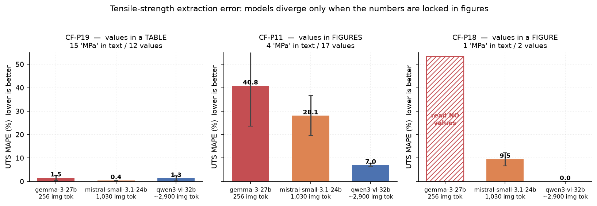

# PEEK-Bench

A benchmark for LLM extraction of process–property data from **figure-heavy** additive-manufacturing
papers. The task: given a PDF of an FFF/FDM carbon-fibre/PEEK study, emit one row per
printed-and-tested condition with nine process parameters and the ultimate tensile strength.

The interesting part is not the text. It is that **a large share of the target values exist only
inside raster figures** — bar labels, swept curves, axis ticks — so the benchmark measures whether a
model can *read a chart*, not whether it can summarise prose.

**Status: development phase complete. The frozen 10-paper test split has not been run.**

---

## Corpus

| | papers | UTS datapoints |
|---|---|---|
| **dev** | 13 | 113 |
| **test** (frozen, unrun) | 10 | 119 |
| **total** | 23 | 232 |

Ground truth is a curated spreadsheet, **not distributed in this repo**. It is pre-imputation: a
blank means *the paper does not report it*, so `null` is the correct answer and inventing a
plausible default is a scored error (`false_fill_rate`).

## Models

Run locally on an Apple M4 Pro (64 GB unified memory) through LM Studio.

| model | params | image tokens per page |
|---|---|---|
| `gemma-3-27b-it` | 27B | **256** (fixed, 896×896) |
| `mistral-small-3.1-24b-instruct-2503` | 24B | **1,030** |
| `qwen3-vl-32b-instruct` | 32B | **~2,900** (dynamic) |

Image-token budgets were **measured**, not read from documentation: send an identical prompt with
and without a page image and diff `prompt_tokens`. Every qualitative probe we tried ("can you read
this chart?") gave the wrong answer at least once; the token delta never did.

---

## Headline finding

**Chart-reading accuracy is monotonic in image-token budget, and it is not explained by model size.**

Pooled UTS error across the two papers whose values are figure-locked (CF-P11, CF-P18):

| model | image tokens | UTS MAPE | n |
|---|---|---|---|
| gemma-3-27b | 256 | **40.78 %** | 3 |
| mistral-small-3.1 | 1,030 | **18.78 %** | 6 |
| qwen3-vl-32b | ~2,900 | **3.48 %** | 12 |



An 11× spread, correctly ordered. Gemma-3-27B is the **largest** model in the roster and finishes
last, so this is an architectural property rather than a capability ranking.

The mechanism is unusually legible on CF-P18, whose values are printed as data labels on a
2008×716 raster bar chart. Gemma emitted the **correct experimental conditions** — `CF-PEEK 450 °C
/ 10 wt%`, `ESD-PEEK 430 °C / 0 wt%` — with `tensile_strength = null` on *every* row. It located
the experiment and could not resolve the digits. Qwen transcribed all nine bar labels exactly
(UTS MAPE **0.00 %**).

The contrast paper matters as much: **CF-P19** reports its results in a *table*, and all three
models matched 12/12 rows at 0.01–2.24 % MAPE. Same harness, same schema, same models — the only
difference is where the numbers live.

See [docs/findings.md](docs/findings.md) for the full result set, including the supplementary-
information experiment (parameter accuracy 0.393 → 0.916, *p* = 0.0006, *d* = 2.70, with UTS
deliberately unmoved at *p* = 0.93).

## Second finding: benchmark scoring is where the bugs are

Six defects were found in the scorer itself, several of which **inverted the model ranking** —
i.e. the benchmark rewarded worse extraction. Two examples:

- A run that emitted **21 rows with every `tensile_strength` null** scored the paper's *best*
  row-F1 (0.895), beating a run with 52 rows at 47 % UTS accuracy. Rows aligned on input
  parameters alone, so identifying conditions while reporting no measurements won.
- On CF-P18 a model that transcribed the chart **perfectly** scored 0.364 while one returning three
  rows with values wrong by 8–13 MPa scored 0.800 — because correctly-read-but-curator-excluded
  conditions counted as hallucinations.

Every one of these was found by an adversarial pass that re-derived numbers from primary sources,
and each is documented with its reproduction in [docs/scoring-defects.md](docs/scoring-defects.md).
This is arguably the most transferable output of the project: **the metric, not the model, was the
dominant error source.**

---

## Workflow

```
PDF ──► render pages (text + JPEG)
     ──► agentic loop:  view_page(n) / note(text) / submit(rows)
     ──► rows JSON ──► Hungarian alignment vs GT ──► metrics workbook
```

The harness serves the **complete text of every page up front** and page **images on demand**.
That asymmetry is deliberate: text is ~1 token per 4 characters, while one page image costs 256 to
~2,900 tokens. An earlier version capped page text at 1,500 characters and silently hid the
methods section, and both models scored 0/18 on exactly the parameters stated there.

Prefix caching makes the agentic loop **faster** than single-pass (measured 0.73× / 0.77× wall
clock), because the growing conversation prefix is reused across turns.

See [docs/methodology.md](docs/methodology.md) for the scoring rules, the alignment design, and the
two scope mechanisms (`paper_scope.json`, `out_of_scope.json`) that keep undisclosed curation
decisions from being charged to the model.

## Layout

```
harness/     extract10.py       agentic extractor (view_page / note / submit)
scoring/     score10.py         Hungarian alignment + metrics
             schema10.json      12 fields with per-field disambiguations
             paper_scope.json   per-paper scope notes (2 papers)
             out_of_scope.json  conditions excluded by the curator (1 paper)
             audit_findability.py  per-cell answerability audit
runners/     *.sh               campaign scripts; progress.py live progress bar
results/     *.xlsx             scored metrics: summary + per_column sheets only
                                (stamped with the GT filename and md5 they were scored against)
docs/        methodology, findings, scoring defects, next steps
             figures/           bar charts, regenerate with `python make_figures.py`
```

**The ground truth and the source PDFs are not in this repo** — they are the curated research
dataset. The workbooks therefore carry metrics only (`summary`, `per_column`); the sheets holding
ground-truth values were removed before publication.

Reproducing the extraction requires the ground-truth spreadsheet. Set `PEEKBENCH_GT_DIR` to a directory containing
`PEEK2-CF-main-*-peekbench-v*.xlsx`; the scorer resolves the highest version and stamps its name and
MD5 into every workbook, so a result can always be traced to the GT it was scored against.

## Next steps

Ranked, with costs measured rather than estimated — see [docs/next-steps.md](docs/next-steps.md).

1. **Audit the six unaudited test papers** before spending GPU time (56 of 119 test rows). Free.
2. **Resolve CF-P06**, which is fully degenerate under the current schema.
3. **Freeze the configuration** — prompt, scorer, GT hash — and record it.
4. **Run the frozen test**: 90 runs ≈ 9 h wall clock on the M4 Pro.
5. **Cheap control**: `gemma-3-12b-it` on CF-P18 (~12 min) to show the image-token effect is
   architectural, not a size artefact.
