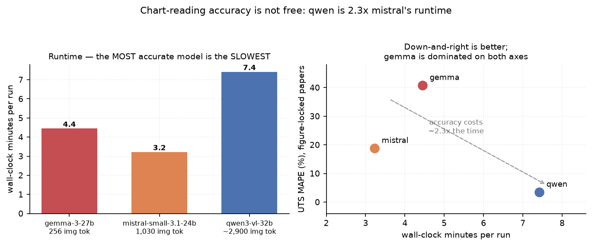
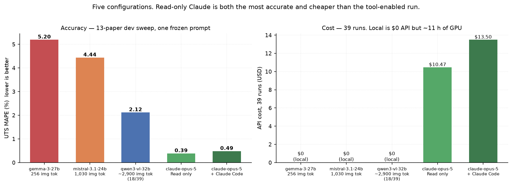
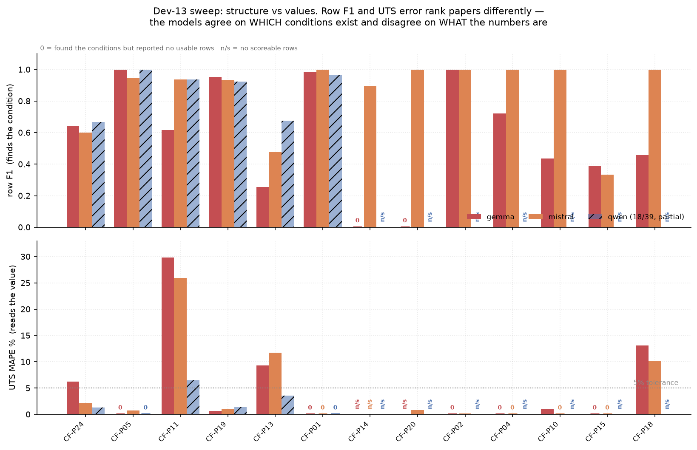

# PEEK-Bench

A benchmark for LLM extraction of process–property data from **figure-heavy** additive-manufacturing
papers. The task: given a PDF of an FFF/FDM carbon-fibre/PEEK study, emit one row per
printed-and-tested condition with nine process parameters and the ultimate tensile strength.

The interesting part is not the text. It is that **a large share of the target values exist only
inside raster figures** — bar labels, swept curves, axis ticks — so the benchmark measures whether a
model can *read a chart*, not whether it can summarise prose.

**Status: a full 13-paper development sweep is running now — 117 runs, all papers under one frozen
prompt. Gemma and Mistral are complete (39/39 each); Qwen is in progress. The frozen 10-paper test
split has not been started.**

---

## Corpus

| | papers | UTS datapoints |
|---|---|---|
| **dev** | 13 | 113 |
| **test** (frozen, unrun) | 10 | 119 |
| **total** | 23 | 232 |

Ground truth is a curated spreadsheet, **not distributed in this repo**. It is pre-imputation: a
blank means *the paper does not report it*, so `null` is the correct answer and inventing a
plausible default is a scored error (`false_fill_rate`).

## Models

Run locally on an Apple M4 Pro (64 GB unified memory) through LM Studio.

| model | params | image tokens per page |
|---|---|---|
| `gemma-3-27b-it` | 27B | **256** (fixed, 896×896) |
| `mistral-small-3.1-24b-instruct-2503` | 24B | **1,030** |
| `qwen3-vl-32b-instruct` | 32B | **~2,900** (dynamic) |

Image-token budgets were **measured**, not read from documentation: send an identical prompt with
and without a page image and diff `prompt_tokens`. Every qualitative probe we tried ("can you read
this chart?") gave the wrong answer at least once; the token delta never did.

---

## Two experiment generations — read the labels

This repo contains results from **two separate runs**, and the same model appears in both with
different numbers. They are not interchangeable:

| | papers | prompt | status |
|---|---|---|---|
| **A. Early per-paper runs** | CF-P11, P13, P18, P19 | **mixed versions**, changed mid-campaign | complete, superseded |
| **B. Dev-13 sweep** | all 13 dev papers | **one frozen version** | gemma + mistral complete, **qwen in progress** |

**Generation B supersedes A** for any model comparison. A is retained because it contains the
supplementary-information A/B and the early figure/table contrast, which B does not repeat.
Every table below states which generation it comes from.

## Headline finding — generation A (early per-paper runs, mixed prompts)

**Chart-reading accuracy is monotonic in image-token budget, and it is not explained by model size.**

Pooled UTS error across the two papers whose values are figure-locked (CF-P11, CF-P18):

| model | image tokens | UTS MAPE | runtime | runs |
|---|---|---|---|---|
| gemma-3-27b | 256 | **40.78 %** | 4.4 min/run | 3 |
| mistral-small-3.1 | 1,030 | **18.78 %** | **3.2 min/run** | 6 |
| qwen3-vl-32b | ~2,900 | **3.48 %** | 7.4 min/run | 12 |


An 11× spread, correctly ordered. Gemma-3-27B is the **largest** model in the roster yet is the
**least accurate** on these papers, so this is an architectural property rather than a capability
ranking.

*("Least accurate", not slowest — on wall-clock time the ordering is nearly reversed. See
[speed](#accuracy-costs-time) below.)*

The mechanism is unusually legible on CF-P18, whose values are printed as data labels on a
2008×716 raster bar chart. Gemma emitted the **correct experimental conditions** — `CF-PEEK 450 °C
/ 10 wt%`, `ESD-PEEK 430 °C / 0 wt%` — with `tensile_strength = null` on *every* row. It located
the experiment and could not resolve the digits. Qwen transcribed all nine bar labels exactly
(UTS MAPE **0.00 %**).

The contrast paper matters as much: **CF-P19** reports its results in a *table*, and all three
models matched 12/12 rows at 0.01–2.24 % MAPE. Same harness, same schema, same models — the only
difference is where the numbers live.

See [docs/findings.md](docs/findings.md) for the full result set, including the supplementary-
information experiment (parameter accuracy 0.393 → 0.916, *p* = 0.0006, *d* = 2.70, with UTS
deliberately unmoved at *p* = 0.93).

## Accuracy costs time

Reading a chart properly is not free. Mean wall-clock per run, same M4 Pro, three papers:

| model | CF-P19 | CF-P11 | CF-P18 | **mean** | UTS MAPE (figure-locked) |
|---|---|---|---|---|---|
| mistral-small-3.1-24b | 3.6 | 3.7 | 2.3 | **3.2 min** | 18.78 % |
| gemma-3-27b-it | 5.3 | 3.9 | 4.1 | **4.4 min** | 40.78 % |
| qwen3-vl-32b-instruct | 9.9 | 7.8 | 4.5 | **7.4 min** | **3.48 %** |

**The most accurate model is the slowest — 2.3× Mistral and 1.7× Gemma.** Gemma is neither fastest
nor most accurate, which is the least useful position to occupy: its fixed 256-token image encoder
means the extra time buys nothing on figure-locked papers.

The tradeoff is worth stating explicitly because it drives campaign cost. A full 10-paper × 3-model
× 3-repeat test run is ≈ 9 h; dropping to Qwen alone would be slower per run but is the only
configuration that reads charts reliably.



## Dev-13 sweep — generation B (primary result, in progress)

All 13 development papers, 3 models × 3 repeats = 117 runs, one frozen prompt version. **This is the
result to cite**; generation A above came from mixed prompt versions and is not poolable with it.

> **qwen3-vl-32b is still running (18/39 runs, 6/13 papers).** Its row is marked partial everywhere
> it appears and must not be compared against the completed rows — the papers it has covered so far
> are not a random subset. Charts draw it hatched and semi-transparent rather than omitting it.

| configuration | model | tools | image path | runs | row F1 | cell | UTS acc | **UTS MAPE** | API cost |
|---|---|---|---|---|---|---|---|---|---|
| gemma | `gemma-3-27b-it` | agentic view/note/submit | JPEG, **256** tok | 39 | 0.573 | 0.798 | 0.761 | 5.20 | $0 · local |
| mistral | `mistral-small-3.1-24b-instruct-2503` | agentic view/note/submit | JPEG, **1,030** tok | 39 | 0.856 | 0.906 | 0.808 | 4.44 | $0 · local |
| qwen *(partial)* | `qwen3-vl-32b-instruct` | agentic view/note/submit | JPEG, **~2,900** dyn | **18/39** | *0.850* | *0.897* | *0.877* | *2.12* | $0 · local |
| **claude** | `claude-opus-5` | **Read only** | PDF native | 39 | **0.950** | **0.963** | **0.982** | **0.39** | **$10.47** |
| **claude code** | `claude-opus-5` | Read + Bash + Write + Edit | PDF native + code | 39 | 0.933 | 0.962 | 0.968 | 0.49 | $13.50 |

Local models: LM Studio on one Apple M4 Pro (64 GB), contexts 40,960 / 32,768 / 65,536. Claude rows:
Anthropic API through Claude Code, orchestrated as parallel subagents (12.9 min wall clock, 2.0 h
serial-equivalent for 39 runs). **Both Claude rows are the same model** — the only variable is tool
access.

API cost at **$5/MTok input + $25/MTok output** ([Opus 5 / Opus 4.8 standard rates](https://platform.claude.com/docs/en/about-claude/pricing)),
assuming a 90 % input share since PDF page images dominate. Token counts are exact; dollars scale
with your rate. The Batch API would halve these to **$5.24 / $6.75**. Local models cost nothing in
API terms but consumed ~11 h of GPU for the equivalent 117 runs.



**Claude is ~11× more accurate on tensile values than either completed local model, for about a
dollar a paper**, and the gap is concentrated exactly where the benchmark is hard:

| paper | claude | mistral | gemma |
|---|---|---|---|
| CF-P11 (figure sweeps) | **1.96** | 25.96 | 29.84 |
| CF-P18 (printed bar labels) | **0.00** | 10.17 | 13.11 |
| CF-P13 (SI + figures) | **1.78** | 11.70 | 9.28 |

### The result is reading, not tooling — verified by ablation

The first Claude run made **220 Bash calls against 138 Reads**: agents were rendering pages at
1100 dpi and detecting axis ticks programmatically. That would make the headline a
chart-*digitisation* result rather than a chart-*reading* one, so it was re-run on five papers with
**code execution forbidden** — Read tool only, verified against the transcripts (44 Read calls,
**zero** Bash/Write/Edit across 15/15 agents).

Across all 13 papers, **Read-only beat the tool-enabled run on every metric** — row F1 0.950 vs
0.933, UTS MAPE **0.39 vs 0.49** — and cost 22 % less. On the five papers examined first, including
CF-P24 where the tool-enabled agents had digitised the axes at 1100 dpi:

| paper | claude READ-ONLY | claude + code | mistral | gemma |
|---|---|---|---|---|
| CF-P11 | 1.96 | 1.59 | 25.96 | 29.84 |
| CF-P13 | 1.78 | 1.68 | 11.70 | 9.28 |
| CF-P18 | 0.00 | 0.00 | 10.17 | 13.11 |
| CF-P19 *(table control)* | 0.40 | 0.40 | 1.00 | 0.64 |
| CF-P24 | **0.54** | 2.16 | 2.11 | 6.25 | Eyeballing beat computing. The agents' own provenance says so: *"EVERY
tensile_strength below is an EYEBALL ESTIMATE against the y-axis"* — landing within 2 % on a paper
where Gemma is 30 % out.

**Caveats that stay attached to this row.** Claude reads the PDF through a document-reading tool
rather than fixed-budget JPEGs, so it does not have a comparable "image tokens" figure — the
comparison is *agentic system* vs *local VLM at a fixed image budget*, not a controlled swap of one
variable. Contamination was controlled by running every extraction in a fresh subagent with no
access to the session that built the ground truth, barred from opening any spreadsheet; the
provenance strings cite page numbers and figure panels. All four systems may have seen these
published papers in training — a shared confound, not a Claude-specific one.

**Cost**: the 39-run Claude sweep used **1.93 M tokens** and **12.9 min wall clock** (2.0 h serial,
run in parallel), versus ~11 h of local GPU for the equivalent 117 local runs.

**Paired across all 13 papers, Mistral beats Gemma on structure but not on reading values:**

| metric | mistral better on | *p* (Wilcoxon) |
|---|---|---|
| row F1 | 8/13 papers | **0.043** |
| cell accuracy | 6/11 papers | **0.031** |
| UTS MAPE | 4/11 papers | 0.38 — no difference |

Both structural metrics are significant; value accuracy is not. On the figure-locked CF-P11 the two
are effectively tied at **25.96 % vs 29.84 %** error — both catastrophic. So 256 and 1,030 image
tokens *both* fail at chart reading, which suggests a **threshold** rather than a smooth gradient.
Qwen's ~2,900 will decide that.



Much of Mistral's F1 advantage is not superior alignment but simply *writing numbers down*:
`CF-P14 0.000 → 0.894`, `CF-P20 0.000 → 1.000`, `CF-P18 0.457 → 1.000`. Those are papers where
Gemma returned rows with every `tensile_strength` null.

### Two failure modes found during the sweep

**Context exhaustion (harness bug, not model weakness).** Three runs returned zero rows — all
Mistral, all on the three longest papers. CF-P15 is 23 pages ≈ 20,700 text tokens; add two page
images at 1,030 each and the 32,768-token context is ~72 % consumed before generation. The evidence
is decisive: the CF-P15 run that viewed **one** page succeeded, and both runs that viewed **two**
pages returned empty completions at the same turn. Mistral's numbers here are therefore a **floor** —
it should be re-run at 65,536 context before any Gemma-vs-Mistral claim is published.

**Reported-but-unread rows.** Gemma scored `row F1 = 0.000` on CF-P14 and CF-P20 not by finding
nothing, but by finding every condition and reporting no values. See [docs/metrics.md](docs/metrics.md).

## Second finding: benchmark scoring is where the bugs are

Six defects were found in the scorer itself, several of which **inverted the model ranking** —
i.e. the benchmark rewarded worse extraction. Two examples:

- A run that emitted **21 rows with every `tensile_strength` null** scored the paper's *best*
  row-F1 (0.895), beating a run with 52 rows at 47 % UTS accuracy. Rows aligned on input
  parameters alone, so identifying conditions while reporting no measurements won.
- On CF-P18 a model that transcribed the chart **perfectly** scored 0.364 while one returning three
  rows with values wrong by 8–13 MPa scored 0.800 — because correctly-read-but-curator-excluded
  conditions counted as hallucinations.

Every one of these was found by an adversarial pass that re-derived numbers from primary sources,
and each is documented with its reproduction in [docs/scoring-defects.md](docs/scoring-defects.md).
This is arguably the most transferable output of the project: **the metric, not the model, was the
dominant error source.**

---

## Workflow

```
PDF ──► render pages (text + JPEG)
     ──► agentic loop:  view_page(n) / note(text) / submit(rows)
     ──► rows JSON ──► Hungarian alignment vs GT ──► metrics workbook
```

The harness serves the **complete text of every page up front** and page **images on demand**.
That asymmetry is deliberate: text is ~1 token per 4 characters, while one page image costs 256 to
~2,900 tokens. An earlier version capped page text at 1,500 characters and silently hid the
methods section, and both models scored 0/18 on exactly the parameters stated there.

Prefix caching makes the agentic loop **faster** than single-pass (measured 0.73× / 0.77× wall
clock), because the growing conversation prefix is reused across turns.

See [docs/methodology.md](docs/methodology.md) for the scoring rules, the alignment design, and the
two scope mechanisms (`paper_scope.json`, `out_of_scope.json`) that keep undisclosed curation
decisions from being charged to the model.

## MCP server and Skill

`mcp_server/peek_bench_mcp.py` serves the corpus and scores submissions **without exposing ground
truth** — `submit_extraction` returns metrics only, so a held-out split can be evaluated without
being consumed. Tools: `list_papers`, `get_paper_text`, `get_page_image` (native resolution),
`get_scope_note`, `get_answerability`, `submit_extraction`. Submissions are logged with a row hash,
because unlimited scored submissions turn a test split into a training signal.

`skills/peek-extract/SKILL.md` packages the extraction protocol: inclusion criteria, all ten field
disambiguations, the eight rules, and the five traps actually observed in this corpus.

> Note: do **not** name the server directory `mcp/` — it shadows the installed `mcp` package and
> `import mcp.server` will fail.

## Reproducing a run

See **[RUNNING.md](RUNNING.md)** for the full setup, and **[docs/prompt.md](docs/prompt.md)** for
the verbatim prompt as sent to the model. The corpus PDFs and ground-truth spreadsheet are not
published here — you need both from the maintainer.

```bash
export PEEKBENCH_ROOT=/path/to/peek_bench_2026
export PEEKBENCH_GT_DIR=$PEEKBENCH_ROOT/group_truth_excel_file
pip install requests pymupdf pandas numpy scipy openpyxl matplotlib
nohup caffeinate -i ./runners/dev13_sweep.sh &    # 117 runs, ~11 h on an M4 Pro
python runners/progress.py                         # live progress + metrics
```

## Layout

```
harness/     extract10.py       agentic extractor (view_page / note / submit)
             calibration/       page rendering + action parsing (imported by extract10)
scoring/     score10.py         Hungarian alignment + metrics
             schema10.json      12 fields with per-field disambiguations
             paper_scope.json   per-paper scope notes (2 papers)
             out_of_scope.json  conditions excluded by the curator (1 paper)
             audit_findability.py  per-cell answerability audit
runners/     *.sh               campaign scripts; progress.py live progress bar
results/     *.xlsx             scored metrics: summary + per_column sheets only
                                (stamped with the GT filename and md5 they were scored against)
docs/        prompt.md          the VERBATIM prompt, regenerable and diffable
             methodology, metrics, findings, scoring defects, next steps
             figures/           bar charts, regenerate with `python make_figures.py`
```

**The ground truth and the source PDFs are not in this repo** — they are the curated research
dataset. The workbooks therefore carry metrics only (`summary`, `per_column`); the sheets holding
ground-truth values were removed before publication.

Reproducing the extraction requires the ground-truth spreadsheet. Set `PEEKBENCH_GT_DIR` to a directory containing
`PEEK2-CF-main-*-peekbench-v*.xlsx`; the scorer resolves the highest version and stamps its name and
MD5 into every workbook, so a result can always be traced to the GT it was scored against.

## Next steps

Ranked, with costs measured rather than estimated — see [docs/next-steps.md](docs/next-steps.md).

1. **Audit the six unaudited test papers** before spending GPU time (56 of 119 test rows). Free.
2. **Resolve CF-P06**, which is fully degenerate under the current schema.
3. **Freeze the configuration** — prompt, scorer, GT hash — and record it.
4. **Run the frozen test**: 90 runs ≈ 9 h wall clock on the M4 Pro.
5. **Cheap control**: `gemma-3-12b-it` on CF-P18 (~12 min) to show the image-token effect is
   architectural, not a size artefact.
6. **Serve the benchmark over MCP** — add `get_page_image`, `submit_extraction` and
   `get_answerability` to the existing `peek-paper-md` server. Scoring server-side keeps ground
   truth off the client, which is what lets a held-out split be published rather than spent.
7. **Package the workflows as Skills** — `peek-extract`, `peek-score`, `peek-curate`. The scoring
   one generalises: the six defects here are a checklist any extraction benchmark could run
   against itself.

---

## Total development time estimate

Everything below is **measured** from run artefacts on disk, not recalled.

### Development phase (complete)

| | |
|---|---|
| **Model inference** | **12.5 h** across **88 runs** (mean 8.5 min/run) |
| **Calendar span** | ~1.1 days of elapsed wall clock, 2026-07-24 → 2026-07-26 |
| **Papers exercised** | 6 of 23 (CF-P05, P11, P13, P18, P19, P24) |
| **Hardware** | one Apple M4 Pro, 64 GB unified memory — no cloud, no GPU rental |
| **Code written** | ~1,100 lines of Python + 6 runner scripts |

Inference time by model — note the same asymmetry the benchmark measures, showing up as cost:

| model | runs | total |
|---|---|---|
| qwen3-vl-32b | 29 | **7.2 h** |
| gemma-3-27b | 29 | 2.6 h |
| mistral-small-3.1-24b | 29 | 2.1 h |

**Qwen alone consumed 58 % of all compute** while running the same number of extractions. That is
the accuracy/cost tradeoff expressed as a budget line rather than a per-run average.

### What the 12.5 h actually bought

Only a minority went to the results in this repo. The rest went to work that produced no headline
number but without which the headline numbers would have been wrong:

- **Discarded runs.** The supplementary A/B was run twice — 9 runs under a harness that failed
  1-in-3, then 18 more after the fixes. CF-P18 and CF-P11 were each re-run after scope corrections.
  Roughly a third of all compute was superseded.
- **Model triage.** Several candidate models were downloaded and probed before three were kept.
  Three early verdicts were **wrong** and had to be retracted — each from a qualitative probe rather
  than a measurement, which is why image-token budgets are now measured by token delta.
- **Scorer debugging.** Six defects, several found only by re-deriving numbers from primary
  sources. No GPU cost, but it dominated the human/agent time and changed published rankings.

### Cost of a full sweep, by split

Projected from measured throughput — gemma 0.355, mistral 0.275, qwen 0.565 min/page — at
3 models × 3 repeats per paper.

| split | papers | runs | inference | + model-load | status |
|---|---|---|---|---|---|
| **dev-13** | 13 | 117 | **11.1 h** | ~2.0 h | 6 papers done, **7 never run (6.8 h)** |
| **test-10** (frozen) | 10 | 90 | **7.6 h** | ~1.5 h | not started |
| **both** | 23 | 207 | **18.7 h** | ~3.5 h | — |

Per-paper cost is driven by page count, not by how many datapoints a paper yields — which makes
some papers poor value. CF-P15 costs 82 min for **2** datapoints; CF-P19 costs 22 min for **12**.
The dev papers already run were, by luck rather than design, the cheap and informative ones.

| dev paper | pages | UTS pts | 9 runs | |
|---|---|---|---|---|
| CF-P24 | 11 | 20 | 39 min | done |
| CF-P05 | 11 | 18 | 39 min | done |
| CF-P11 | 10 | 17 | 36 min | done |
| CF-P19 | 6 | 12 | 22 min | done |
| CF-P13 | 21 | 11 | 75 min | done |
| CF-P18 | 13 | 2 | 47 min | done |
| CF-P01 | 19 | 10 | 68 min | **not run** |
| CF-P14 | 21 | 9 | 75 min | **not run** |
| CF-P20 | 17 | 5 | 61 min | **not run** |
| CF-P02 | 9 | 3 | 32 min | **not run** |
| CF-P10 | 17 | 2 | 61 min | **not run** |
| CF-P15 | 23 | 2 | 82 min | **not run** |
| CF-P04 | 8 | 2 | 29 min | **not run** |

**Completing dev-13 is not obviously worth 6.8 h.** The seven unrun papers hold 33 datapoints
between them, and five of the seven are text/table papers where all three models already score
within ~1.5 % — they would mostly confirm the ceiling effect seen on CF-P19. CF-P14 (9 pts,
partly figure-locked) is the one with real information left in it.

### Remaining to a complete benchmark

| item | cost |
|---|---|
| Audit the 6 unaudited test papers | no GPU — **blocking** |
| Frozen test run: 10 papers × 3 models × 3 repeats = 90 runs | **7.6 h** + ~1.5 h model-load overhead |
| `gemma-3-12b-it` control on CF-P18 | ~12 min |
| **Total to publishable** | **≈ 9–10 h**, one overnight run |
| *(optional)* finish dev-13 — 7 papers, 63 runs | 6.8 h, low expected yield |

### Honest read on the estimate

The **12.5 h of inference is the small part**. The dominant costs were curation and metric design:
tracing four undisclosed scope filters, finding six scoring defects, and reconciling ground-truth
cells against the source papers — all of which changed results and none of which is visible in a
runtime total.

A team reproducing this with the ground truth in hand and the scorer already correct would need
roughly **10 h of compute and a day of setup**. Building it from scratch — including discovering
that the metric, not the model, was the dominant error source — took substantially longer than the
compute suggests.
