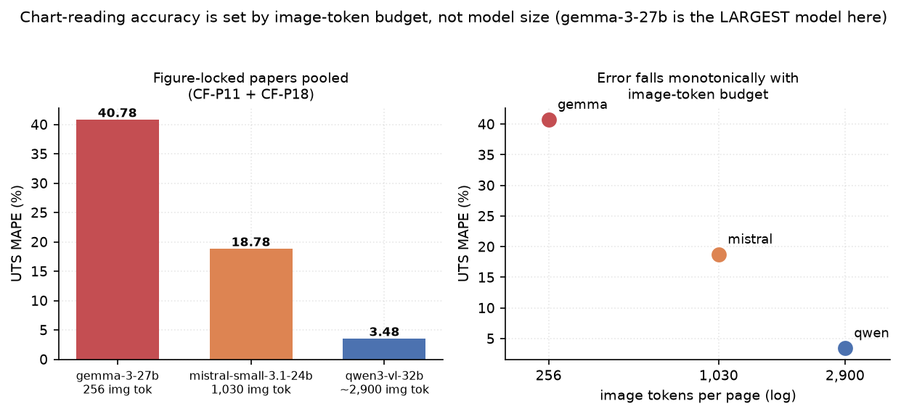
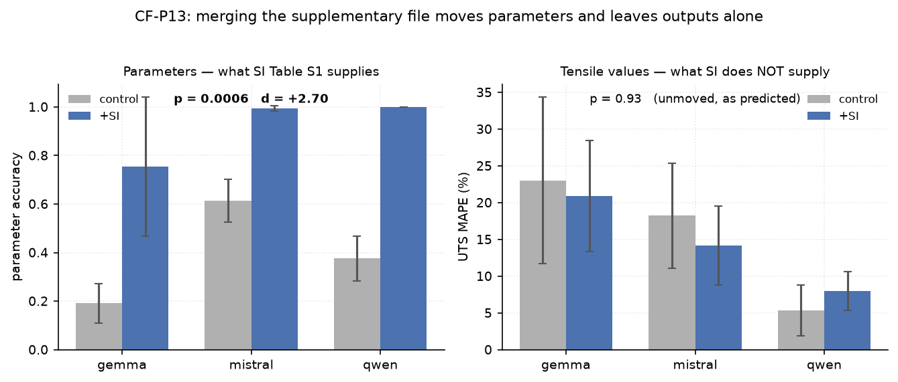
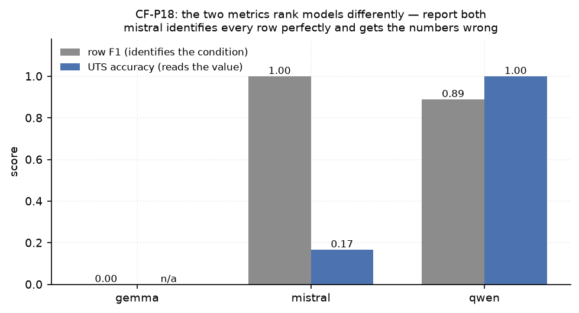

# Findings

All numbers below come from runs on the **development** split. The frozen 10-paper test split has
not been run. Ground truth is not distributed with this repo, so the workbooks in `results/` carry
metrics only (`summary`, `per_column`); each is stamped with the GT filename and MD5 it was scored
against.

---

## 1. Chart-reading accuracy tracks image-token budget, not model size

Two papers in the dev split have tensile values that exist **only inside raster figures**:

- **CF-P18** (Nyman 2024) — values printed as data labels on a 2008×716 bar chart. The string
  `MPa` appears **once** in the entire PDF text layer, in a literature-reference sentence.
- **CF-P11** (Hu 2021) — three OFAT sweeps plotted as curves. `MPa` appears **4 times** for
  **17** tensile values, so the text layer cannot be carrying them.

*The same three models on three papers. Where the values are tabulated (left) every model is
within 1.5 %; where they are locked in figures the spread opens to 40 %. Gemma's hatched column on
the right is not missing data — it returned rows with every tensile value null.*

Pooled UTS error over both:

| model | image tokens/page | UTS MAPE | runs |
|---|---|---|---|
| gemma-3-27b-it | 256 (fixed 896×896) | **40.78 %** | 3 |
| mistral-small-3.1-24b | 1,030 | **18.78 %** | 6 |
| qwen3-vl-32b-instruct | ~2,900 (dynamic) | **3.48 %** | 12 |

Per paper:

| paper | model | row F1 | cell acc | UTS acc | UTS MAPE | min/run |
|---|---|---|---|---|---|---|
| CF-P11 | gemma | 0.684 | 0.505 | 0.041 | 40.78 | 3.9 |
| | mistral | 0.926 | 0.863 | 0.207 | 28.08 | 3.7 |
| | **qwen** | **0.959** | 0.825 | **0.680** | **6.96** | 7.8 |
| CF-P18 | gemma | 0.000 | — | — | — | 4.1 |
| | mistral | 1.000 | 0.883 | 0.167 | 9.49 | 2.3 |
| | **qwen** | 0.889 | **1.000** | **1.000** | **0.00** | 4.5 |

**Why this is architectural rather than a capability ranking.** Gemma-3-27B is the *largest* model
in the roster and places last. Its CF-P18 output is the clearest evidence: it emitted the **correct
conditions** — `CF-PEEK 450 °C / 10 wt%` and `ESD-PEEK 430 °C / 0 wt%`, both exactly right — with
`tensile_strength = null` on **every row**. It found the experiment and could not resolve the
digits. Gemma 3 encodes any image as a fixed 256 tokens at 896×896; a 2008×716 chart downsampled
into that budget loses its labels. Mistral reads them approximately; Qwen transcribes them exactly.

**The contrast case.** **CF-P19** (Rehekampff 2019) reports its results in a *table*
(`MPa` appears 15 times for 12 values). All three models matched **12/12 rows** with UTS MAPE
0.01–2.24 %. Same harness, same schema, same models — the only variable is where the numbers live.
This is what isolates figure-reading as the capability under test.

**Open control worth running.** A single `gemma-3-12b-it` pass on CF-P18 (~12 min) would confirm
the effect is architectural rather than specific to the 27B checkpoint. All Gemma 3 vision models
share the 256-token encoder, so the prediction is that 12B also returns correct conditions with
null values.

---

## 2. Supplementary information moves parameters and leaves outputs alone

CF-P13 (Li 2023) states its process parameters **only in supplementary Table S1**; the main
article does not contain them. A/B over the same paper — main article (11 pp) vs main + SI merged
(21 pp) — 3 models × 3 repeats per arm, 18 runs:

| metric | control | +SI | Mann-Whitney *p* | Cohen *d* |
|---|---|---|---|---|
| **parameter accuracy** (what SI supplies) | 0.393 | **0.916** | **0.0006** | **+2.70** |
| **UTS MAPE** (what SI does *not* supply) | 15.54 | 14.35 | 0.93 | −0.13 |

The dissociation is the result. The intervention moved exactly the metric it should and left the
other untouched — a stronger claim than "everything improved". It was pre-registered in the runner
script before the runs, on the reasoning that SI Table S1 carries parameters while tensile values
live in the main article's figures.

Per model, parameter accuracy control → +SI: gemma 0.191 → 0.754, mistral 0.613 → **0.993**,
qwen 0.376 → **1.000**. Qwen and Mistral reach the paper's answerability ceiling.

**Methodological warning from this experiment.** An earlier version of the A/B reported gemma at
`0.895 ± 0.002` — remarkably consistent. That average was over the **two runs that survived**; the
third was a zero-row failure that had been dropped. With all three runs completing, gemma is
`0.681 ± 0.237`. The harness was not producing consistent results, it was discarding its worst
ones. Any benchmark that drops failed runs before averaging overstates both accuracy *and*
stability.

---

## 3. Row F1 and UTS accuracy rank models differently

On CF-P18, Mistral identifies **every** row correctly (`row F1 = 1.000`) while getting the numbers
wrong (`UTS acc = 0.167`); Qwen reads every value exactly but returned one row too few on one of
three repeats. Reporting either metric alone inverts the ranking. Row F1 measures *did you find the
condition*; UTS accuracy measures *did you read the number*. They are different capabilities and
this benchmark separates them.

## 4. Failure modes worth naming

- **Value replication.** On CF-P11, one model emitted 52–57 rows covering the paper's full
  3-material × 3-sweep design (which is real — Figure 4 sweeps all three materials), but filled
  17–18 bare-PEEK rows with a single repeated value where the true curve spans 44.0–67.6 MPa.
  Conditions right, numbers fabricated. A prompt rule reading *"two materials across a 5-level
  sweep = 10 rows"* invited exactly this and was rewritten.
- **Sweep collapse.** On CF-P11, gemma and mistral emit `raster_angle = 0` for *every* row against
  a ground-truth sweep of 0–90°. They reproduce the parameter they expect rather than the one that
  varies.
- **Structurally valid, semantically empty.** One run returned 9 rows with every
  `tensile_strength` null — not caught by a zero-row check, and (before the fix) scored well.
- **Over-narrowing under scope instructions.** After adding per-paper scope notes, 2 of 18 runs
  collapsed to a single row (`gemma-r3` on CF-P11, `qwen-r1` on CF-P18). A cost of the mechanism,
  not noise.
